## 今日内容

* 通过mybatis框架，实现对单表的增删改查


## 第一章 框架简介

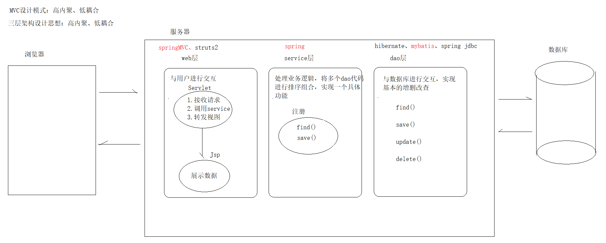 


### 1 回顾三层架构

在java语言中开发软件的架构是三层架构，之所以流行是因为有着清晰的任务划分。一般包括以下三层：  

- 持久层：主要完成与数据库相关的操作，即对数据库的增删改查。  
- 业务层：主要根据功能需求完成业务逻辑的定义和实现。  
- 表现层：主要完成与软件用户的交互，需要有交互界面（UI）。  


### 2 框架

**什么是框架？**

- 把重复的代码工作抽取出来，让程序员把精力专注在核心的业务代码实现上。
- 框架可以理解为半成品软件，框架做好以后，接下来在它基础上进行开发  


**为什么学习框架？**

- 因为学了它之后，我们的开发确实变得简单。
- 企业开发中都在用，不会它，你就无法正常进入企业进行开发工作。


**java中常见的框架？**

Java世界中的框架非常的多，每一个框架都是为了解决某一部分或某些问题而存在的。

- 持久层框架：专注于解决数据持久化的框架。常用的有mybatis、hibernate、spring jdbc等等。

- 表现层框架：专注于解决与用户交互的框架。常见的有struts2、spring mvc等等。

- 全栈框架: 能在各层都给出解决方案的框架。比较著名的就是spring。


**这么多框架，我们怎么选择呢?**

我们以企业中最常用的组合为准来学习Spring + Spring MVC + mybatis（SSM）


## 第二章 Mybatis简介

### 1 ORM概述

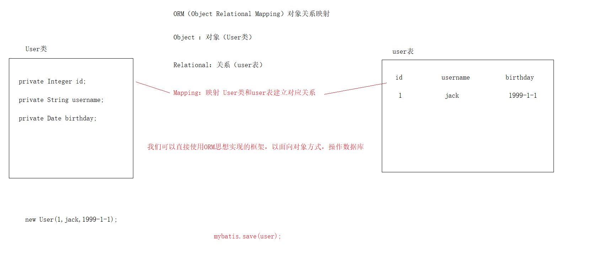 

ORM（Object Relational Mapping）对象关系映射，是一个针对持久层的理论思想。

```markdown
- Objec：对象，这里指的是java类

- Relational：关系，这里指的是数据表

- Mapping：映射，这里指的是java类和数据表之间建立的对应关系
		类名 --> 数据表
		属性名 --> 字段名
```


**ORM用来解决什么问题呢?**

一句话说，就是ORM思想可以让我们以面向对象的形式操作数据库


 **常见的ORM框架有哪些？**

- Hibernate（全自动ORM，是JPA实现的框架）
- Mybatis（半自动ORM，实现自动封装实体、但是需要开发人员编写sql）

  


### 2 MyBatis介绍

**历史**

- MyBatis本是apache的一个开源项目，名为iBatis。
- 2010年这个项目由apache迁移到了google，并且改名为MyBatis。
- 2013年迁移到Github。

**简介**

MyBatis官网地址：<http://www.mybatis.org/mybatis-3/> 

- MyBatis是一款优秀的持久层框架，它不需要像JDBC那样去写复杂代码、手动设置参数、繁琐的处理结果集

- 它采用简单的XML配置 + 接口方法的形式实现对数据库的增删改查，使得让程序员只关注sql本身


**知识小结：**

**我们不需要再去编写JDBC繁琐的步骤了，通过配置文件+接口方式就可以实现CRUD，我们开发只需要关注sql**


## 第三章 Mybatis快速入门【重点】

**需求**

> 查询数据库user表的所有记录，封装到User对象中。

### 1 开发步骤

```markdown
① 准备mybatis_db和user表

② 创建java模块，并导入相关jar包

③ 创建User实体

④ 编写映射文件 UserMapper.xml

⑤ 编写核心文件 SqlMapConfig.xml （mybatis-config.xml）

⑥ 编写测试
```


### 2 代码实现

##### ① 准备mybatis_db和user表

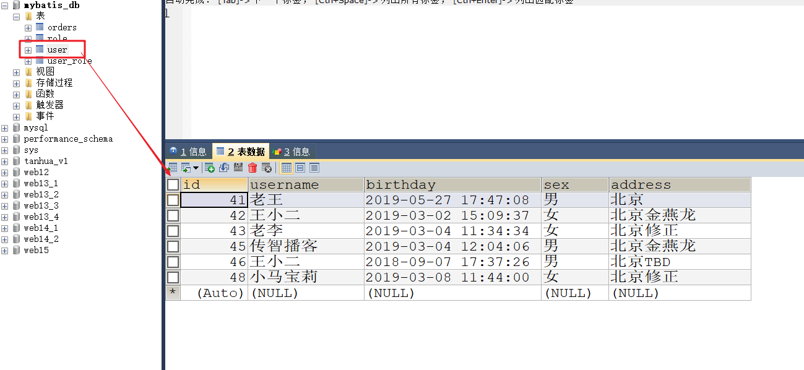 

##### ② 创建java模块，并导入相关jar包

> 切记 add添加

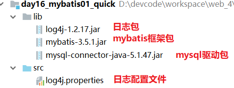 

##### ③ 创建User实体

```java
import java.util.Date;

public class User {
    private Integer id;
    private String username;
    private Date birthday;
    private String sex;
    private String address;

    public User() {
    }

    public User(final Integer id, final String username, final Date birthday, final String sex, final String address) {
        this.id = id;
        this.username = username;
        this.birthday = birthday;
        this.sex = sex;
        this.address = address;
    }

    public Integer getId() {
        return this.id;
    }

    public void setId(final Integer id) {
        this.id = id;
    }

    public String getUsername() {
        return this.username;
    }

    public void setUsername(final String username) {
        this.username = username;
    }

    public Date getBirthday() {
        return this.birthday;
    }

    public void setBirthday(final Date birthday) {
        this.birthday = birthday;
    }

    public String getSex() {
        return this.sex;
    }

    public void setSex(final String sex) {
        this.sex = sex;
    }

    public String getAddress() {
        return this.address;
    }

    public void setAddress(final String address) {
        this.address = address;
    }

    @Override
    public String toString() {
        return "User{" +
                "id=" + id +
                ", username='" + username + '\'' +
                ", birthday=" + birthday +
                ", sex='" + sex + '\'' +
                ", address='" + address + '\'' +
                '}';
    }
}
```


##### ④ 编写映射文件 UserMapper.xml

```xml
<?xml version="1.0" encoding="UTF-8" ?>
<!DOCTYPE mapper PUBLIC "-//mybatis.org//DTD Mapper 3.0//EN" "http://mybatis.org/dtd/mybatis-3-mapper.dtd">
<mapper namespace="UserMapper">

    <!-- 查询所有  resultType 查询结果对应的实体类型 -->
    <!-- 查询语句 -->
    <select id="findAll" resultType="cn.com.mryhl.domain.User">
        select * from user
    </select>

</mapper>
```


##### ⑤ 编写核心文件 SqlMapConfig.xml （mybatis-config.xml）

```xml
<?xml version="1.0" encoding="UTF-8" ?>
<!-- 引入约束文件 -->
<!DOCTYPE configuration PUBLIC "-//mybatis.org//DTD Config 3.0//EN" "http://mybatis.org/dtd/mybatis-3-config.dtd">
<configuration>
    <!-- 配置数据库环境文件 -->
    <!-- default 引入的数据库-->
    <environments default="mysql">
        <!-- mysql环境 -->
        <environment id="mysql">
            <!--事物管理器 固定格式-->
            <transactionManager type="JDBC"></transactionManager>
            <!-- 数据源: 使用内置的连接池 -->
            <dataSource type="POOLED">
                <property name="driver" value="com.mysql.jdbc.Driver"/>
                <property name="url" value="jdbc:mysql://localhost:3306/mybatis_db"/>
                <property name="username" value="root"/>
                <property name="password" value="root"/>
            </dataSource>
        </environment>
    </environments>

    <!-- 加载映射文件 -->
    <mappers>
        <mapper resource="cn/com/mryhl/mapper/UserMapper.xml"></mapper>
    </mappers>
</configuration>
```


##### ⑥ 编写测试

```java
/**
     * 查询所有数据
     *
     */
    @Test
    public void test01() throws Exception {
        // 加载核心文件
        InputStream in = Resources.getResourceAsStream("SqlMapConfig.xml");
        // 构建工厂对象'
        SqlSessionFactory sqlSessionFactory = new SqlSessionFactoryBuilder().build(in);
        // 创建会话对象
        SqlSession sqlSession = sqlSessionFactory.openSession();
        // 调用API执行sql语句
        // 参数:命名空间.id
        List<User> list = sqlSession.selectList("UserMapper.findAll");
        for (User user : list) {
            System.out.println(user);
        }
        // 释放资源
        sqlSession.close();

    }
```


## 第四章 Mybatis映射文件概述

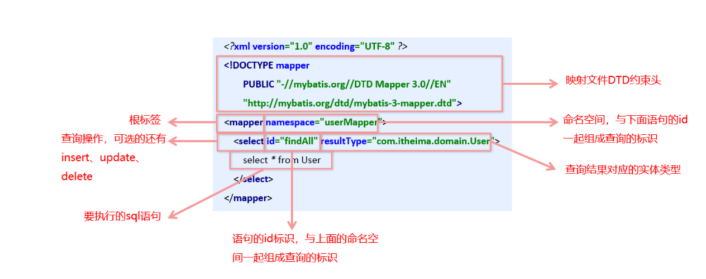 


## 第五章 完成增删改操作  【了解】

### 1 新增

> 需求: 向数据库user表新增一条记录  


##### ① 编写UserMapper.xml

```xml
<!--添加一条记录-->
    <insert id="save" parameterType="cn.com.mryhl.domain.User">
        insert into user values (null,#{username},#{birthday},#{sex},#{address})
    </insert>
```


##### ② 编写测试类

```java
/**
     * 添加记录
     */
    @Test
    public void test02() throws Exception {
        // 加载核心文件
        InputStream in = Resources.getResourceAsStream("SqlMapConfig.xml");
        // 构建工厂对象'
        SqlSessionFactory sqlSessionFactory = new SqlSessionFactoryBuilder().build(in);
        // 创建会话对象
        SqlSession sqlSession = sqlSessionFactory.openSession();
        // 调用API执行sql语句
        // 创建实体类对象
        User user = new User();
        user.setUsername("jack");
        user.setBirthday(new Date());
        user.setSex("男");
        user.setAddress("滨海区");
        int insert = sqlSession.insert("UserMapper.save", user);
        System.out.println(insert);
        // 释放资源
        sqlSession.commit();
        sqlSession.close();
    }
```


##### ③ 新增注意事项

```markdown
1. 新增操作使用 <insert></insert> 标签

2. parameterType属性为传递参数的java类型

3. #{} 相当于?占位符，花括号内写实体的属性名

4. 新增操作的API使用 sqlSession.insert(“命名空间.id”,实体对象);

5. DML操作需要手动提交事务 sqlSession.commit()
```


### 2 修改

> 需求: 根据user的主键修改其他属性  


##### ① 编写UserMapper.xml

```xml
<!--修改记录-->
    <update id="update" parameterType="cn.com.mryhl.domain.User">
        update user set username = #{username} , birthday = #{birthday} , sex = #{sex} ,address = #{address} where id = #{id}
    </update>
```


##### ② 编写测试类

```java
/**
     * 修改记录
     */
    @Test
    public void test03() throws Exception {
        // 加载核心文件
        InputStream in = Resources.getResourceAsStream("SqlMapConfig.xml");
        // 构建工厂对象'
        SqlSessionFactory sqlSessionFactory = new SqlSessionFactoryBuilder().build(in);
        // 创建会话对象
        SqlSession sqlSession = sqlSessionFactory.openSession();
        // 调用API执行sql语句
        // 创建实体类对象
        User user = new User();
        user.setId(49);
        user.setUsername("Tom");
        user.setBirthday(new Date());
        user.setSex("男");
        user.setAddress("滨海区");
        int update = sqlSession.update("UserMapper.update", user);
        System.out.println(update);
        // 释放资源
        sqlSession.commit();
        sqlSession.close();
    }
```

##### ③ 修改注意事项

```markdown
1. 修改操作使用 <update></update> 标签

2. parameterType属性为传递参数的java类型

3. #{} 相当于?占位符，花括号内写实体的属性名

4. 修改操作的API使用 sqlSession.update(“命名空间.id”,实体对象);

5. DML操作需要手动提交事务 sqlSession.commit()
```


### 3 删除

> 需求:根据主键删除一个用户  


##### ① 编写UserMapper.xml

```xml
<!--删除记录-->
    <delete id="delete" parameterType="int">
        delete from user where id = #{id}
    </delete>
```

##### ② 编写测试类

```java
/**
     * 删除记录
     */
    @Test
    public void test04() throws Exception {
        // 加载核心文件
        InputStream in = Resources.getResourceAsStream("SqlMapConfig.xml");
        // 构建工厂对象'
        SqlSessionFactory sqlSessionFactory = new SqlSessionFactoryBuilder().build(in);
        // 创建会话对象
        SqlSession sqlSession = sqlSessionFactory.openSession();
        // 调用API执行sql语句
        // 创建实体类对象

        int delete = sqlSession.delete("UserMapper.delete", 49);
        System.out.println(delete);
        // 释放资源
        sqlSession.commit();
        sqlSession.close();
    }
```


##### ③ 删除注意事项

```markdown
1. 删除操作使用 <delete></delete> 标签

2. parameterType属性为传递参数的java类型

3. #{} 相当于?占位符，如果传递是简单类型，花括号内随便写，通常做到见名之意即可

4. 删除操作的API使用 sqlSession.delete(“命名空间.id”,主键);

5. DML操作需要手动提交事务 sqlSession.commit()
```


### 4 工具类

> ​	我们编写了CRUD案例，发现了测试代码加载文件、创建会话对象，都属于公共部分，可以抽取到工具类中，简化代码，提高效率

```java
import org.apache.ibatis.io.Resources;
import org.apache.ibatis.session.SqlSession;
import org.apache.ibatis.session.SqlSessionFactory;
import org.apache.ibatis.session.SqlSessionFactoryBuilder;

import java.io.IOException;
import java.io.InputStream;

public class MyBatisUtils {
    private static SqlSessionFactory sqlSessionFactory;

    static {
        try {
            // 1.加载核心文件
            InputStream in = Resources.getResourceAsStream("SqlMapConfig.xml");
            // 2.构建工厂对象
            sqlSessionFactory = new SqlSessionFactoryBuilder().build(in);
        } catch (IOException e) {
            throw new RuntimeException("mybatis框架初始化失败...");
        }
    }

    // 获取sqlSession方法
    public static SqlSession openSession() {
        return sqlSessionFactory.openSession();
    }

    // 提交事务并释放资源
    public static void release(SqlSession sqlSession) {
        if (sqlSession != null) {
            sqlSession.commit();
            sqlSession.close();
        }
    }
}

```


#### 测试

> 需求，查询id为 41这条记录


##### ① UserMapper.xml

```xml
<!--查询一条记录-->
    <select id="findById" parameterType="int" resultType="cn.com.mryhl.domain.User">
        select * from user where id = #{id}
    </select>
```

##### ② 测试代码

```java
@Test
    public void test05() throws Exception {
        // 获取sqlSession会话
        SqlSession sqlSession = MyBatisUtils.openSession();
        // 调用API
        User user = sqlSession.selectOne("UserMapper.findById", 41);
        System.out.println(user);
        MyBatisUtils.release(sqlSession);
    }
```


## 第六章 Mybatis核心文件概述

### 1 标签层级关系

> MyBatis 的配置文件包含了会深深影响 MyBatis 行为的设置和属性信息。 配置文档的顶层结构如下：

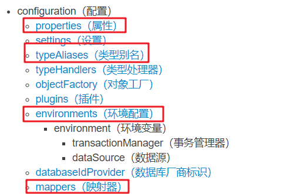 


### 2 常用配置标签

#### **1）environments标签**

> 数据库环境的配置，支持多环境配置

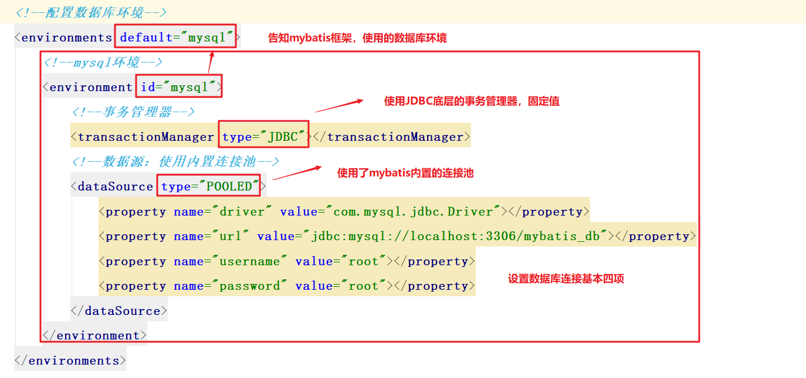 


#### **2）properties标签**

> 加载外置的properties文件

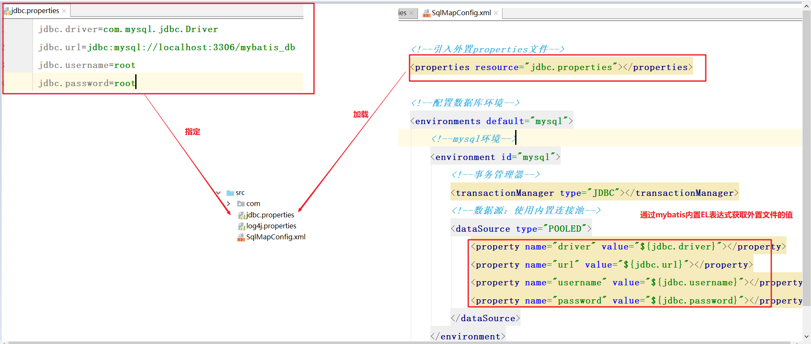 


#### **3）typeAliases标签**

> 类型别名是为 Java 类型设置一个短的名字（别名）。

为了简化映射文件 Java 类型设置，mybatis框架为我们设置好的一些常用的类型的别名： 

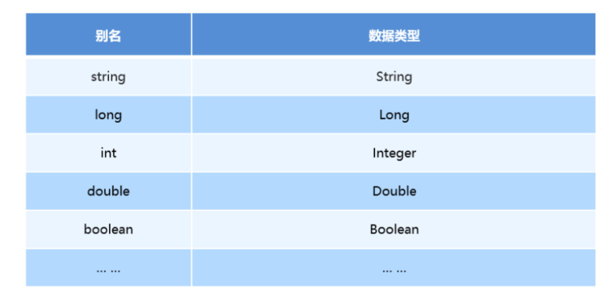 


> 现在我们可以给User实体类设置个别名

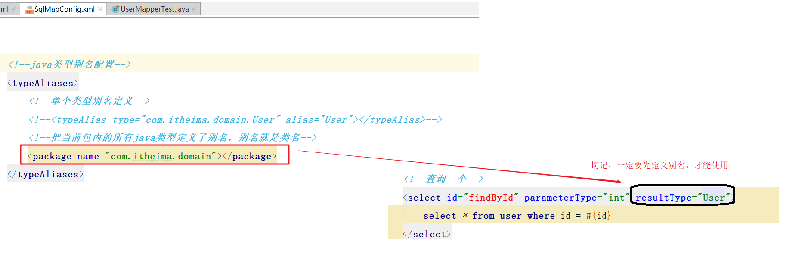 


#### **4）mappers标签**

> 该标签的作用是加载映射文件的，加载方式有如下几种：

```markdown
1. 加载指定的src目录下的映射文件，例如：【今天用】
	<mapper resource="com/itheima/mapper/UserMapper.xml"/>

2. 加载指定接口的全限定名，例如：【注解开发】
	<mapper class="com.itheima.mapper.UserMapper"/>

3. 加载并扫描指定包下所有的接口，例如：【注解开发】
	<package name="com.itheima.mapper"/>
```

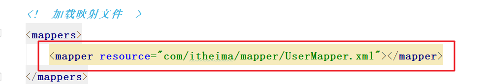 


### 3 标签书写顺序

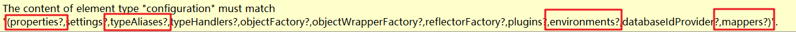


```xml
<?xml version="1.0" encoding="UTF-8" ?>
<!-- 引入约束文件 -->
<!DOCTYPE configuration PUBLIC "-//mybatis.org//DTD Config 3.0//EN" "http://mybatis.org/dtd/mybatis-3-config.dtd">
<configuration>
    <!--引入外置的properties 文件-->
    <properties resource="jdbc.properties"></properties>

    <!--java类别别名设置-->
    <typeAliases>
        <!--单个类型别名定义-->
        <!--<typeAlias type="cn.com.mryhl.domain.User" alias="User"></typeAlias>-->
        <!--把当前包内的所有java类型定义了别名，别名就是类名-->
        <package name="cn.com.mryhl.domain.User"/>
    </typeAliases>
    <!-- 配置数据库环境文件 -->
    <!-- default 引入的数据库-->
    <environments default="mysql">
        <!-- mysql环境 -->
        <environment id="mysql">
            <!--事物管理器 固定格式-->
            <transactionManager type="JDBC"></transactionManager>
            <!-- 数据源: 使用内置的连接池 -->
            <dataSource type="POOLED">
                <!--
                <property name="driver" value="com.mysql.jdbc.Driver"/>
                <property name="url" value="jdbc:mysql://localhost:3306/mybatis_db"/>
                <property name="username" value="root"/>
                <property name="password" value="root"/>
                -->
                <property name="driver" value="${jdbc.driver}"/>
                <property name="url" value="${jdbc.url}"/>
                <property name="username" value="${jdbc.username}"/>
                <property name="password" value="${jdbc.password}"/>
            </dataSource>
        </environment>
    </environments>

    <!-- 加载映射文件 -->
    <mappers>
        <mapper resource="cn/com/mryhl/mapper/UserMapper.xml"></mapper>
    </mappers>
</configuration>
```


## 第七章 Mybatis的API概述

### 1 API介绍

#### **1）Resources**

> 加载mybatis的核心配置文件，获取io流

```java
InputStream inputStream = Resources.getResourceAsStream("SqlMapConfig.xml");
```


#### **2）SqlSessionFactoryBuilder**

> 将mybatis配置文件加载到内存，构建出SqlSessionFactory工厂对象

```java
SqlSessionFactoryBuilder builder = new SqlSessionFactoryBuilder(); 
SqlSessionFactory factory = builder.build(inputStream);
```


#### **3）SqlSessionFactory**

这是一个工厂对象，对于这种创建和销毁都非常耗费资源的重量级对象，一个项目中只需要存在一个即可。
也就是说，它的生命周期跟项目的生命周期是一致的(项目不亡，我不销毁)

> 它的任务是创建SqlSession会话底层

```java
// 需要手动提交事务，DML语句才会持久化到数据库中
SqlSession openSession();

// 设置是否开启自动提交，如果设置为true，开启自动提交事务【了解】
SqlSession openSession(boolean autoCommit);
```


#### **4）SqlSession【核心】**

这是Mybatis的一个核心对象。我们基于这个对象可以实现对数据的CRUD操作。

> 注意：对于这个对象应做到每个线程独有，每次用时打开，用完关闭。

**执行语句的方法主要有：**

```java
<T> T selectOne(String statement, Object parameter);

<E> List<E> selectList(String statement, Object parameter);

int insert(String statement, Object parameter);

int update(String statement, Object parameter);

int delete(String statement, Object parameter);
```


**操作事务的方法主要有：**

```java
void commit();

void rollback();
```


### 2 配置关系

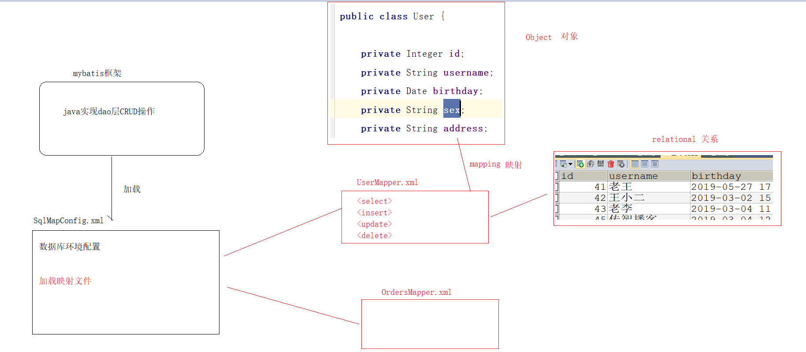 


### 3 框架工作原理

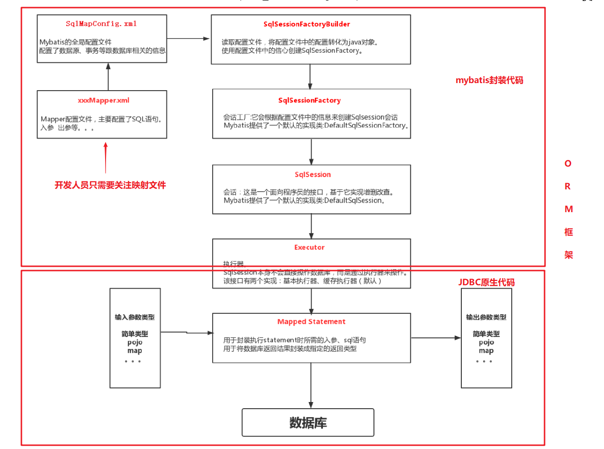 


## 第八章 Mybatis实现Dao层

### 1 传统开发方式【了解】

##### ① 创建新的模块

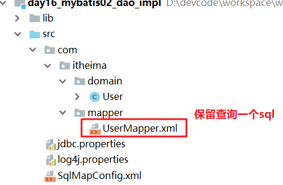 


##### ② 创建UserMapper（UserDao）

```java
import cn.com.mryhl.domain.User;
import org.apache.ibatis.io.Resources;
import org.apache.ibatis.session.SqlSession;
import org.apache.ibatis.session.SqlSessionFactory;
import org.apache.ibatis.session.SqlSessionFactoryBuilder;

import java.io.InputStream;

public class UserMapper {
    // 提供根据id查询的方法
    public User findById(Integer id) throws Exception{
        // 加载核心文件
        InputStream in = Resources.getResourceAsStream("SqlMapConfig.xml");
        // 构建工厂
        SqlSessionFactory sqlSessionFactory = new SqlSessionFactoryBuilder().build(in);
        // 创建会话
        SqlSession sqlSession = sqlSessionFactory.openSession();
        User user = sqlSession.selectOne("UserMapper.findById",id);
        // 释放资源
        sqlSession.close();
        return user;
    }
}

```


##### ③ 映射文件UserMapper.xml

```xml
<?xml version="1.0" encoding="UTF-8" ?>
<!--引入约束文件,DTD约束头-->
<!DOCTYPE mapper PUBLIC "-//mybatis.org//DTD Mapper 3.0//EN" "http://mybatis.org/dtd/mybatis-3-mapper.dtd">
<!--根标签  命名空间,与下面语句的id一起组成查询的标识-->
<mapper namespace="UserMapper">

    <!--查询一条记录-->
    <select id="findById" parameterType="int" resultType="cn.com.mryhl.domain.User">
        select * from user where id = #{id}
    </select>

</mapper>
```


##### ④ 模拟service进行测试

```java
public class UserService {
    @Test
    public void test01() throws Exception {
        // 调用dao
        UserMapper userMapper = new UserMapper();
        User user = userMapper.findById(42);
        System.out.println(user);

    }
}
```


##### ⑤ 通过观察UserMapper代码

> 我们类+方法+参数+返回结果的命名规范，与sqlSession执行底层代码一致，这部分可以交给mybatis通过动态代理，自动生成...

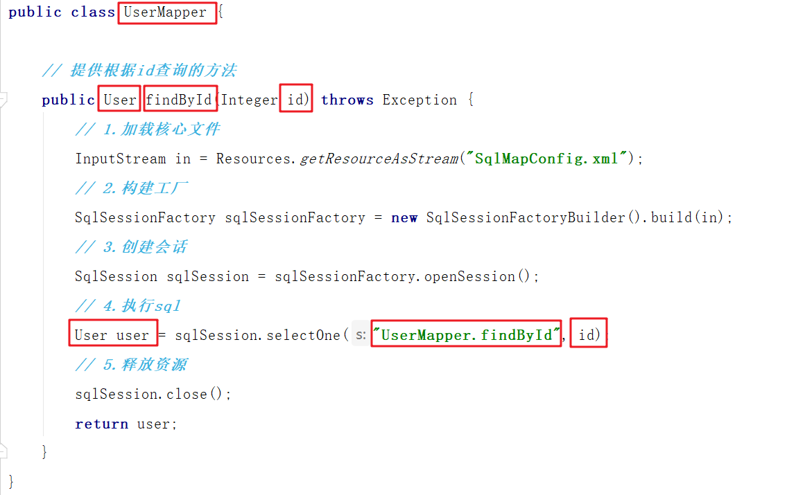 


### 2 接口代理开发方式【掌握】

采用 Mybatis 的基于接口代理方式实现 持久层 的开发，这种方式是我们后面进入企业的主流。

基于接口代理方式的开发只需要程序员编写 Mapper 接口，Mybatis 框架会为我们动态生成实现类的对象。


**需要遵循以下命名规范**

```markdown
1. Mapper映射文件的namespace属性是接口的权限定名
		namespace="com.itheima.mapper.UserMapper"
		
2. select等标签的id属性名与接口的方法名一致
		  id="findById"
		 
3. select等标签的parameterType的类型与方法的参数类型一致
		parameterType="int"
		
4. select等标签的resultType的类型与方法的返回值类型一致
		resultType="com.itheima.domain.User"
```

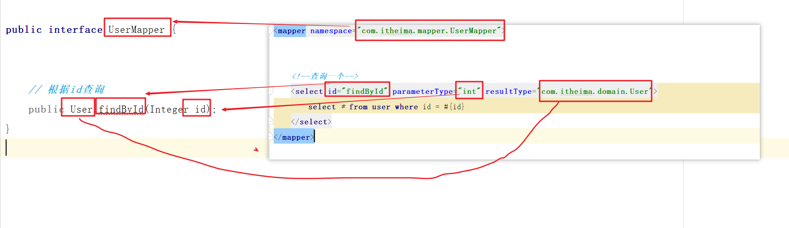 


##### ① 复制刚才传统dao模块

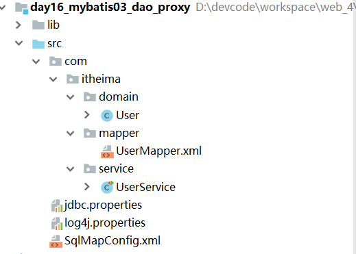 


##### ② 编写UserMapper接口

```java
public interface UserMapper {


    // 根据id查询
    public User findById(Integer id);
}
```

##### ③ 编写映射UserMapper.xml

```xml
<?xml version="1.0" encoding="UTF-8" ?>
<!--引入约束文件,DTD约束头-->
<!DOCTYPE mapper PUBLIC "-//mybatis.org//DTD Mapper 3.0//EN" "http://mybatis.org/dtd/mybatis-3-mapper.dtd">
<!--根标签  命名空间,与下面语句的id一起组成查询的标识-->
<mapper namespace="cn.com.mryhl.mapper.UserMapper">

    <!--查询一条记录-->
    <select id="findById" parameterType="int" resultType="cn.com.mryhl.domain.User">
        select * from user where id = #{id}
    </select>

</mapper>
```


##### ④ 模拟service进行测试

```java
import cn.com.mryhl.domain.User;
import cn.com.mryhl.mapper.UserMapper;
import cn.com.mryhl.util.MyBatisUtils;
import org.apache.ibatis.session.SqlSession;
import org.junit.Test;

public class UserService {
    private SqlSession sqlSession;
    private UserMapper userMapper;
    /**
     * 提取共同的内容
     */
    @Before
    public void before(){
        // 获取sqlSession
        sqlSession = MyBatisUtils.openSession();
        // 创建UserMapper代理对象
        userMapper = sqlSession.getMapper(UserMapper.class);
    }
    @After
    public void after(){
        // 释放资源
        MyBatisUtils.release(sqlSession);
    }
    /**
     * 查询一条记录
     * @throws Exception
     */
    @Test
    public void test01() throws Exception {

        User user = userMapper.findById(41);
        System.out.println(user);


    }
}
```


### 3 了解以下mybatis底层动态代理生成

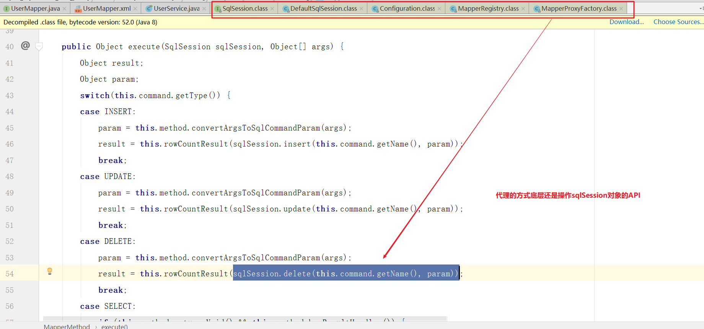 


### 4 练习

#### 新增

##### ① 编写UserMapper接口

```java
// 新增
public void save(User user);
```


##### ② 编写UserMapper.xml

```xml
   <!--添加一条记录-->
    <insert id="save" parameterType="cn.com.mryhl.domain.User">
        insert into user values (null , #{username} ,#{birthday} ,#{sex} ,#{address})
    </insert>
```


##### ③ 测试

```java
    // 测试新增
    @Test
    public void test02() throws Exception {
        // 1.获取sqlSession
        SqlSession sqlSession = MyBatisUtils.openSession();
        // 2.创建UserMapper代理对象
        UserMapper userMapper = sqlSession.getMapper(UserMapper.class);
        // 3.执行sql
        User user = new User();
        user.setUsername("haha");
        user.setSex("女");
        user.setBirthday(new Date());
        user.setAddress("北京");
        userMapper.save(user);
        // 4.释放资源
        MyBatisUtils.release(sqlSession);
    }
```


#### 修改

##### ① 编写UserMapper接口

```java
public void update(User user);
```

##### ② 编写UserMapper.xml

```xml
<!--修改记录-->
<update id="update" parameterType="cn.com.mryhl.domain.User">
    update user set username = #{username} , birthday = #{birthday} , sex = #{sex} ,address = #{address} where id = #{id}
</update>
```

##### ③ 测试

```java
@Test
public void test03() throws Exception {
    // 3.执行sql
    User user = new User();
    user.setId(48);
    user.setUsername("haha");
    user.setSex("女");
    user.setBirthday(new Date());
    user.setAddress("北京");
    userMapper.update(user);
}
```

#### 删除

##### ① 编写UserMapper接口

```java
public void delete(Integer id);
```

##### ② 编写UserMapper.xml

```xml
<!--删除记录-->
<delete id="delete" parameterType="int">
    delete from user where id = #{id}
</delete>
```

##### ③ 测试

```java
@Test
public void test04() throws Exception {
    // 执行sql语句
    userMapper.delete(43);
}
```


## 第九章 Mybatis高级查询

### 1 ResutlMap标签

如果数据库结果集中的列名和要封装实体的属性名完全一致的话用 resultType 属性


如果数据库结果集中的列名和要封装实体的属性名有不一致的情况用 resultMap 属性，通过resultMap手动建立对象关系映射。

```xml
<?xml version="1.0" encoding="UTF-8" ?>
<!DOCTYPE mapper PUBLIC "-//mybatis.org//DTD Mapper 3.0//EN" "http://mybatis.org/dtd/mybatis-3-mapper.dtd">
<mapper namespace="com.itheima.mapper.UserMapper">

     <!--查询一条记录-->
    <!--
        手动映射封装
            id="BaseMap" 该标签的唯一标识
            type="cn.com.mryhl.domain.User" 封装后的java类型
    -->
    <resultMap id="BaseMap" type="cn.com.mryhl.domain.User">
        <!--
            column="uid" 数据库查询的字段名
            property="id" 需要封装到实体属性名
        -->
        <id column="uid" property="id"></id>
        <result column="name" property="username"></result>
        <result column="bir" property="birthday"></result>
        <result column="gender" property="sex"></result>
        <result column="addr" property="address"></result>
    </resultMap>


    <!--查询一个-->
    <select id="findById" parameterType="int" resultMap="BaseMap">
        SELECT id AS uid,username AS `name`, birthday AS bir,sex AS gender, address AS addr FROM USER WHERE id = #{id}
    </select>


</mapper>
```


### 2 多条件查询

**需求**

> ​	根据id和username查询user表
>


#### 方式一【了解】

- 使用 `#{arg0}-#{arg1}` 或者 `#{param1}-#{param2}` 获取参数


##### 接口

```java
// 多条件查询方式一
public List<User> findByIdAndUsername1(Integer id,String username);
```

##### 映射

```xml
<!--
    多条件查询方式一
        注意：此parameterType属性只能出现一次，如果传递多个值，可以省略
    -->
    <select id="findByIdAndUsername1" resultType="cn.com.mryhl.domain.User">
        <!-- select * from user where id = #{arg0} and username = #{arg1} -->
        select * from user where id = #{param1} and username = #{param2}
    </select>
```

##### 测试

```java
/**
     * 测试方式一
     */
    @Test
    public void test02() throws Exception {
        List<User> list = userMapper.findByIdAndUsername1(41, "老王");
        System.out.println(list);
    }
```


#### 方式二

- 使用注解`@Param()`注解获取参数


##### 接口

```java
// 多条件查询方式二
public List<User> findByIdAndUsername2(@Param("id") Integer id,@Param("username") String username);
```

##### 映射

```xml
    <!--
多条件查询方式二
    注意：此parameterType属性只能出现一次，如果传递多个值，可以省略
-->
    <select id="findByIdAndUsername2" resultType="cn.com.mryhl.domain.User">
    select * from user where id = #{id} and username = #{username}
</select>
```

##### 测试

```java
    /**
     * 测试方式二
     */
    @Test
    public void test03() throws Exception {
        List<User> list = userMapper.findByIdAndUsername2(41, "老王");
        System.out.println(list);
    }
```


#### 方式三

- 使用实体对象传递参数


##### 接口

```java
// 多条件查询方式三
public List<User> findByIdAndUsername3(User user);
```

##### 映射

```xml
<!--
    多条件查询方式三
    -->
<select id="findByIdAndUsername3" parameterType="cn.com.mryhl.domain.User" resultType="cn.com.mryhl.domain.User">
    select * from user where id = #{id} and username = #{username}
</select>
```

##### 测试

```java
    /**
     * 测试方式三
     */
    @Test
    public void test04() throws Exception {
        User user = new User();
        user.setId(41);
        user.setUsername("老王");
        List<User> list = userMapper.findByIdAndUsername3(user);
        System.out.println(list);
    }
```


### 3 模糊查询

**需求**

> ​	根据username模糊查询user表
>


#### 方式一

##### 接口

```java
// 模糊查询方式一
public List<User> findLikeUsername1(String username);
```

##### 映射

```xml
    <!--
           模糊查询方式一
    -->

    <select id="findLikeUsername1" parameterType="string" resultType="cn.com.mryhl.domain.User">
    select * from user where username like #{username}
    </select>
```


##### 测试

```java
@Test
public void test05() throws Exception {
    List<User> list = userMapper.findLikeUsername1("%王%");
    for (User user : list) {
        System.out.println(user);
    }

}
```

 


#### 方式二

##### 接口

```java
// 模糊查询方式二
public List<User> findLikeUsername2(String username);
```

##### 映射

```xml
    <!--
   模糊查询方式二
    oracle数据库 双引号除了别名的位置上，其他地方使用报错...
    -->

    <select id="findLikeUsername2" parameterType="string" resultType="cn.com.mryhl.domain.User">
      select * from user where username like "%" #{username} "%"
    </select>
```

##### 测试

```java
@Test
    public void test06() throws Exception {
        List<User> list = userMapper.findLikeUsername2("王");
        for (User user : list) {
            System.out.println(user);
        }

    }
```


#### 方式三

##### 接口

```java
// 模糊查询方式三
public List<User> findLikeUsername3(String username);
```

##### 映射

```xml
 <!--
   模糊查询方式三
    ${} 底层使用字符串拼接，可能会出现sql注入问题，开发绝对不用
    如果你传递的是简单数据类型 ${value}
    -->

    <select id="findLikeUsername3" parameterType="string" resultType="cn.com.mryhl.domain.User">
      select * from user where username like '%${value}%'
    </select>
```

##### 测试

```java
@Test
public void test07() throws Exception {
    List<User> list = userMapper.findLikeUsername3("王");
    for (User user : list) {
        System.out.println(user);
    }

}
```

 


#### 方式四【掌握】

##### 接口

```java
// 模糊查询方式四
public List<User> findLikeUsername4(String username);
```

##### 映射

```xml
<!--
   模糊查询方式四
    使用concat()函数帮我们进行拼接，注意oracle数据库中此函数只能传递二个参数，需要进行嵌套
    -->

    <select id="findLikeUsername4" parameterType="string" resultType="cn.com.mryhl.domain.User">
        select * from user where username like  concat(concat('%',#{username}),'%')
    </select>
```


##### 测试

```java
@Test
public void test07() throws Exception {
    List<User> list = userMapper.findLikeUsername3("王");
    for (User user : list) {
        System.out.println(user);
    }

}
```

 


### 4 面试题

`${}` 与 `#{}` 区别

**`#{}`:表示一个占位符号** 

- 通过`#{}`可以实现preparedStatement向占位符中设置值，自动进行java类型和jdbc类型转换，#{}可以有效防止sql注入。
- `#{}`可以接收简单类型值或实体属性值。 
- 如果parameterType传输单个简单类型值，`#{}`括号中名称任意。 


**`${}`:表示拼接sql串 **

- 通过`${}`底层使用statement对象内容拼接在sql中且不进行jdbc类型转换，会出现sql注入问题。

- `${}`可以接收简单类型值或实体属性值。

- 如果parameterType传输单个简单类型值，`${}`括号中只能是value。

  - > 补充：TextSqlNode.java 源码可以证明


```markdown
* 简单类型
	string、int（Integer）、long、double

* 实体（复杂）类型
	new User()
	
```


## 第十章 返回主键

**需求**

向数据库保存一个用户后, 然后在控制台记录下此用户的主键值(id)


#### 接口

```java
    // 返回主键
    public void save(User user);
```


#### 映射

##### 方式一

```xml
    <!--
        返回主键 方式一
            useGeneratedKeys="true" 开启返回主键功能
            keyColumn="id" 数据库主键列
            keyProperty="id" 实体主键属性
            
            这种方式操作虽然简单，但仅支持主键自增类型的数据库：mysql、sqlServer
    -->
    <insert id="save" parameterType="cn.com.mryhl.domain.User" useGeneratedKeys="true" keyColumn="id" keyProperty="id">
         insert into user values(null,#{username},#{birthday},#{sex},#{address})
    </insert>
```


##### 方式二

```xml
    <!--
        返回主键方式二
            keyColumn="id" 表的主键列
            keyProperty="id" 实体的主键属性
            resultType="int" 实体主键的java类型
            order="AFTER"  selectKey标签sql语句的执行时机
                before：在insert语句执行之前，执行
                after：在insert语句执行之后，执行
        
            这种方式虽然繁琐，但是通用...
    -->
   <insert id="save" parameterType="cn.com.mryhl.domain.User">
        <selectKey keyColumn="id" keyProperty="id" resultType="int" order="AFTER">
            SELECT LAST_INSERT_ID()
        </selectKey>
        insert into user values(#{id},#{username},#{birthday},#{sex},#{address})
    </insert>
```


#### 测试


```java
@Test
    public void test08() throws Exception {
        User user = new User();
        user.setUsername("lucy");
        user.setSex("女");
        user.setBirthday(new Date());
        user.setAddress("北京");
        userMapper.save(user);

        System.out.println(user.getId());

    }
```

## 总结

```mark
一 框架简介
	MVC模式
		model模型
		view视图
		controller控制器
	三层架构
		web层
		service层
		dao层
	什么是框架？
		半成品软件 
	常见框架
		持久层
			mybatis
			hibernate
			spring jdbc
		表现层
			struts2
			spring mvc
		全栈（业务层）
			spring
二 Mybatis简介
	mybatis是一款优秀的持久层框架，封装了jdbc实现细节，让开发者只关注sql本身。
	mybatis是ORM映射框架
三 Mybatis快速入门
	1. 创建mybatis_db数据库和user表
	2. 创建java项目，引入MyBatis相关jar包
	3. 创建User实体类
	4. 编写映射文件UserMapper.xml
	5. 编写核心文件SqlMapConfig.xml
	6. 编写测试类
四 Mybatis映射文件概述
	 
五 完成增删改操作  
六 Mybatis核心文件概述
	environments标签
		数据库环境配置
	properties标签
		引入第三方配置
	typeAliases标签
		实体别名配置
	mappers标签
		加载映射配置
七 Mybatis的API概述
	Resources
		加载核心配置文件
	SqlSessionFactoryBuilder
		构建工厂对象
	SqlSessionFactory
		生产会话对象
	SqlSession
		实现与数据库CRUD操作
八 Mybatis实现Dao层
	传统方式
	接口代理方式
		
九 Mybatis高级查询
	resultMap标签
		解决：如果实体的属性名与表的字段名不一致，需要使用ResultMap手动进行封装
	多条件查询
		二个及以下参数，简单类型@Param
		二个及以上参数，封装实体中
	模糊查询
		concat() 函数拼接
	${}与#{}区别
		${}  statement
		#{} preparedStatement
十 返回主键
	useGeneratedKeys
		支持主键自增类型的数据库：MySQL、sqlServer
	selectKey
		order属性（执行时机）
			before
			after
```

