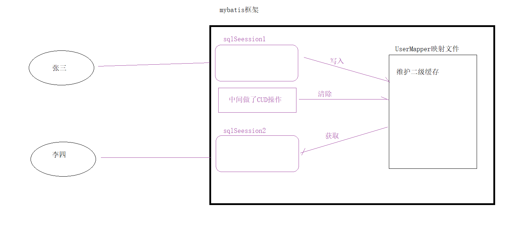

## 今日内容
+ 动态sql

+ 多表关联查询

+ 多表嵌套查询

+ 延迟（懒）加载【了解】

+ 内置缓存【了解】
	+ 一级缓存
	+ 二级缓存


## 第一章 Mybatis动态SQL

### 1 什么是动态SQL

**先来看一个需求**

把页面输入的id和username封装到User实体中，并作为条件查询数据库

 


**这个时候我们执行的sql就有多种可能**

```sql
-- 如果id和用户名不为空
select * from user where id= #{id} and username = #{username}

-- 如果只有id
select * from user where id= #{id} 

-- 如果只有用户名
select * from user where username = #{username}

-- 如果id和用户名都为空
select * from user
```

> 像上面这样, 根据传入的参数不同, 需要执行的SQL的结构就会不同，这就是动态SQL。
>

### 2 环境搭建

 

### 3  if 和 where 标签

> 需求：页面输入的id和username封装到User实体中，并作为条件查询数据库

##### 接口

```java
    // if 和 where 标签
    public List<User> findByIf(User user);
```

##### 映射

```xml
<!--
        if和where标签
        if:条件判断
        where : 动态where,如果没有条件where关键字不在拼接,如果有条件,去掉第一个 and 或是 or
    -->
    <select id="findByIf" parameterType="cn.com.mryhl.domain.User" resultType="cn.com.mryhl.domain.User">
        select * from user
        <where>
            <if test="id != null">
                and id = #{id}
            </if>
            <if test="username != null">
                and username = #{username}
            </if>
        </where>
    </select>
```

##### 测试

```java
public class UserMapperTest {
	private SqlSession sqlSession;
    private UserMapper userMapper;
    @Before
    public void before(){
        // 获取sqlSession
        sqlSession = MyBatisUtils.openSession();
        // 创建UserMapper代理对象
        userMapper = sqlSession.getMapper(UserMapper.class);
    }
    @After
    public void after(){
        // 释放资源
        MyBatisUtils.release(sqlSession);
    }

    /**
     * if和where测试
     */
    @Test
    public void test02() throws Exception {
        // 封装条件
        User user = new User();
        user.setId(41);
        user.setUsername("老王");

        // 执行查询
        List<User> userList = userMapper.findByIf(user);
        System.out.println(userList);

    }
}
```


##### 小结

```markdown
* if标签用于单分支条件判断, 相当于java中的if关键字
* where标签作用
		当where代码块中的条件都不成立的时候, where不在拼接
		当where代码块中的条件至少有一个成立的时候，它会帮你去掉第一个and|or
```


### 4 if 和 set 标签

> 需求：动态更新user表数据，如果该属性有值就更新，没有值不做处理

##### 接口

```java
// set标签
public void updateIf(User user);
```

##### 映射

```xml
<!--
        set标签
        帮你去掉最后一个逗号
    -->
    <update id="updateIf" parameterType="cn.com.mryhl.domain.User">
        update  user
        <set>
            <if test="username != null">
                username = #{username},
            </if>
            <if test="birthday != null">
                birthday = #{birthday},
            </if>
            <if test="sex != null">
                sex = #{sex},
            </if>
            <if test="address != null">
                address = #{address},
            </if>

        </set>
        where id = #{id}
    </update>
```

##### 测试

```java
/**
     * set标签
     */
    @Test
    public void test03() throws Exception {
        // 封装修改内容
        User user = new User();
        user.setId(45);
        user.setUsername("东方盖花");
        // 执行更新
        userMapper.updateIf(user);


    }
```

##### 小结

```markdown
* set标签作用
		在代码块之前加入一个set关键字  
		删除掉代码块中的最后一个逗号（,）
```


### 5 foreach 标签

> 需求：根据多个id查询，user对象的集合

```sql
select * from user where id in (41,45,46);
```

```xml
* <foreach>标签用于遍历集合，它的属性：

    • collection：代表要遍历的集合元素

    • open：代表语句的开始部分

    • close：代表结束部分

    • item：代表遍历集合的每个元素，生成的变量名

    • sperator：代表分隔符
```


**传递参数三种场景**

- 普通list集合
- 普通array数组
- 实体中list | array


##### 接口

```java
// 普通list集合
public List<User> findList(List<Integer> ids);

// 普通array数组
public List<User> findArray(Integer[] ids);

// 实体中的list属性
public List<User> findQueryVo(QueryVo queryVo);
```

##### 映射

```xml
<!--
        foreach标签:普通的list
        collection属性值只能为: list | collection

    -->
    <select id="findList" parameterType="list" resultType="cn.com.mryhl.domain.User">
        select  * from user  where id in
        <foreach collection="list" open="(" close=")" item="id" separator=",">
            #{id}
        </foreach>
    </select>


    <!--
        foreach标签:普通的数组array
        collection属性值只能为: array

    -->
    <select id="findArray" parameterType="int" resultType="cn.com.mryhl.domain.User">
        select  * from user  where id in
        <foreach collection="array" open="(" close=")" item="id" separator=",">
            #{id}
        </foreach>
    </select>


    <!--
        foreach标签:实体中的list
        collection属性值只能为: 实体属性名

    -->
    <select id="findQueryVo" parameterType="cn.com.mryhl.domain.QueryVo" resultType="cn.com.mryhl.domain.User">
        <include refid="selectUser"></include>  where id in
        <foreach collection="ids" open="(" close=")" item="id" separator=",">
            #{id}
        </foreach>
    </select>


    <!--
        抽取sql片段
    -->
    <sql id="selectUser">
        select  * from user
    </sql>
```

##### 测试

```java
/**
     * foreach标签
     */
    @Test
    public void test04() throws Exception {
        // 普通list
        /*ArrayList<Integer> ids = new ArrayList<>();
        ids.add(41);
        ids.add(45);
        ids.add(46);

        List<User> list = userMapper.findList(ids);
        System.out.println(list);*/

        // 普通array
        /*Integer[] ids = {41,45,46};
        List<User> userList = userMapper.findArray(ids);
        System.out.println(userList);*/


        // 实体list
        QueryVo queryVo = new QueryVo();

        List<Integer> ids = new ArrayList<>();
        ids.add(41);
        ids.add(45);
        ids.add(46);
        queryVo.setIds(ids);
        List<User> list = userMapper.findQueryVo(queryVo);
        System.out.println(list);
    }
```

##### 小结

```markdown
* foreach标签的collection属性根据传输的java类型不同而采用不同的值
		集合：list   
		数组：array   
		实体：实体的属性名
```


### 6 SQL片段

**应用场景**

映射文件中可将重复的 sql 提取出来，使用时用 include 引用即可，最终达到 sql 复用的目的


## 第二章 Mybatis多表查询  

### 1 表关系回顾

> 在关系型数据库中，表关系分为以下三种：

 


```markdown
* 在数据库中表建立关系：通过主外键关联

* 在java中实体建立关系：通过属性关联

* 在mybatis框架中把（多对一）也可以理解（一对一）
	在订单的角度去看，一个订单只从属于一个用户
```


> 今天讲解多表练习

 


### 2 环境搭建

##### ① 创建java模块，导入jar包

 


##### ② 准备三个实体类

```java
// 用户
public class User {

    private Integer id;
    private String username;
    private Date birthday;
    private String sex;
    private String address;
    
}


// 订单实体类
public class Order {

    private Integer id;

    private Date ordertime;

    private Double money;

}

// 角色
public class Role {

    private Integer id;

    private String role_name;

    private String role_desc;
}
```


##### ③ 创建三个接口和三个映射文件

 


##### ④ 创建mybatis核心文件

 


##### ⑤ 导入MybatisUtils工具类

 


##### ⑥ 抽取测试基类

```java
public class BaseMapperTest {
    protected SqlSession sqlSession;

    @Before
    public void before(){
        // 获取sqlSession
        sqlSession = MyBatisUtils.openSession();


    }
    @After
    public void after(){
        // 释放资源
        MyBatisUtils.release(sqlSession);
    }

}
```

 


### 3 一对一（多对一）

**一对一查询模型**

用户表和订单表的关系为，一个用户有多个订单，一个订单只从属于一个用户

> 需求：查询一个订单，与此同时查询出该订单所属的用户

 

**sql语句**

```sql
SELECT * FROM orders o INNER JOIN `user` u ON o.`uid` = u.`id` WHERE o.id = 1 
```


##### ① 实体和表映射关系

 


##### ② 创建Order实体

```java
public class Order {
    private Integer id;
    private Date ordertime;
    private Double money;

    // 一个订单从属于一个用户

    private  User user;
}
```

##### ③ 编写OrderMapper接口

```java
public interface OrderMapper {

    // 根据订单id查询，返回订单信息和用户信息
    public Order findByIdWithUser(Integer id);
}
```


##### ④ 编写OrderMapper.xml

```xml
<?xml version="1.0" encoding="UTF-8" ?>
<!--引入约束文件,DTD约束头-->
<!DOCTYPE mapper PUBLIC "-//mybatis.org//DTD Mapper 3.0//EN" "http://mybatis.org/dtd/mybatis-3-mapper.dtd">
<!--根标签  命名空间,与下面语句的id一起组成查询的标识-->
<mapper namespace="cn.com.mryhl.mapper.OrderMapper">

    <!--一对一手动映射封装-->
    <resultMap id="orderBaseMap" type="cn.com.mryhl.domain.Order">
        <id column="id" property="id"></id>
        <result column="ordertime" property="ordertime"></result>
        <result column="money" property="money"></result>

        <!--
            association 一对一关联封装
                property="user" 订单中的实体属性名
                javaType="com.itheima.domain.User" 该属性对应的java类型
        -->
        <association property="user" javaType="cn.com.mryhl.domain.User">
            <id column="uid" property="id"></id>
            <result column="username" property="username"></result>
            <result column="birthday" property="birthday"></result>
            <result column="sex" property="sex"></result>
            <result column="address" property="address"></result>
        </association>
    </resultMap>
    <!--

        一对一查询
    -->
    <select id="findByIdWithUser" parameterType="int" resultMap="orderBaseMap">
        select * from orders o inner join user u on o.uid = u.id where o.id = #{id}
    </select>

</mapper>
```


##### ⑤ 测试

```java
import cn.com.mryhl.domain.Order;
import cn.com.mryhl.mapper.OrderMapper;
import org.junit.Test;

public class OrderMapperTest extends BaseMapperTest {
    /**
     * 一对一测试
     */
    @Test
    public void test01() throws Exception {
        //获取代理对象
        OrderMapper orderMapper = sqlSession.getMapper(OrderMapper.class);
        // 查询
        Order order = orderMapper.findByIdWithUser(1);

        System.out.println(order);
    }
}
```


##### ⑥ 一对一代码关系图

  


### 4 一对多

**一对多查询模型**

用户表和订单表的关系为，一个用户有多个订单，一个订单只从属于一个用户

> 需求：查询一个用户，与此同时查询出该用户具有的订单

 

**sql语句**

```sql
SELECT *,o.id AS oid FROM `user` u INNER JOIN orders o ON u.`id` = o.`uid` WHERE u.id = 41 
```


##### ① 实体和表映射关系

 


##### ② 编写User实体

```java
public class User {
    private Integer id;
    private String username;
    private Date birthday;
    private String sex;
    private String address;
    private List<Order> orderList;
}
```


##### ③ 编写UserMapper接口

```java
import cn.com.mryhl.domain.User;

public interface UserMapper {
    /**
     * 一对多根据用户id,查询用户和订单信息
     */
    public User findByIdWithOrderList(Integer id);

}
```

##### ④ 编写UserMapper.xml

```xml
<?xml version="1.0" encoding="UTF-8" ?>
<!--引入约束文件,DTD约束头-->
<!DOCTYPE mapper PUBLIC "-//mybatis.org//DTD Mapper 3.0//EN" "http://mybatis.org/dtd/mybatis-3-mapper.dtd">
<!--根标签  命名空间,与下面语句的id一起组成查询的标识-->
<mapper namespace="cn.com.mryhl.mapper.UserMapper">
    <!--一对多手动映射-->
    <resultMap id="userWithOrderMap" type="cn.com.mryhl.domain.User">
        <id column="id" property="id"></id>
        <result column="username" property="username"></result>
        <result column="birthday" property="birthday"></result>
        <result column="sex" property="sex"></result>
        <result column="address" property="address"></result>
        <!--
            一对多封装使用collection标签
                property="orderList" 是user实体的订单属集合名称
                ofType="com.itheima.domain.Order" 封装数据的java类型，可以简单理解为list的泛型
        -->
        <collection property="orderList" ofType="cn.com.mryhl.domain.Order">
            <id column="oid" property="id"></id>
            <result column="ordertime" property="ordertime"></result>
            <result column="money" property="money"></result>
        </collection>
        
    </resultMap>

    <!--
        一对多根据用户id,查询用户和订单信息
    -->
    <select id="findByIdWithOrderList" parameterType="int" resultMap="userWithOrderMap">
        SELECT *,o.id oid FROM USER u INNER JOIN orders o ON u.`id` = o.`uid` WHERE u.`id` = #{id}
    </select>

</mapper>
```

##### ⑤ 测试

```java
import cn.com.mryhl.domain.User;
import cn.com.mryhl.mapper.UserMapper;
import org.junit.Test;

public class UserMapperTest extends BaseMapperTest {
    /**
     * 一对多测试
     */
    @Test
    public void test01() throws Exception {
        //  创建代理对象
        UserMapper userMapper = sqlSession.getMapper(UserMapper.class);

        // 根据用户ID查询
        User byIdWithOrderList = userMapper.findByIdWithOrderList(41);
        System.out.println(byIdWithOrderList);

        // 运行结果
        // User{id=41, username='老王', birthday=Mon May 27 17:47:08 CST 2019, sex='男', address='北京', orderList=[Order{id=1, ordertime=Mon May 20 02:58:02 CST 2019, money=999.5, user=null}, Order{id=3, ordertime=Sat Jun 01 21:00:02 CST 2019, money=1666.0, user=null}]}
        
    }
}

```


##### ⑥ 一对多代码关系图

 


### 5 多对多

**多对多查询的模型**

用户表和角色表的关系为，一个用户有多个角色，一个角色被多个用户使用

> 需求：查询用户同时查询出该用户的所有角色

 s


**注意：多对多实现代码流程跟一对多是一样的，只是sql语句稍有不同**

```sql
SELECT * FROM `user` u
	INNER JOIN user_role ur ON u.id = ur.`uid` -- 用户关联中间表
	INNER JOIN role r ON ur.`rid` = r.`id` -- 中间表关联用户
	WHERE u.id = 41
```


##### ① 实体和表映射关系

  


##### ② 编写User和Role实体

```java
public class User {
    private Integer id;
    private String username;
    private Date birthday;
    private String sex;
    private String address;
    private List<Role> roleList;
}
```

##### ③ 编写UserMapper接口

```java
public interface UserMapper {

    // 多对多根据用户id，查询用户和角色信息
    public User findByIdWithRoleList(Integer id);
}
```

##### ④ 编写UserMapper.xml

```xml
<!--
        多对多手动映射封装
    -->
    <resultMap id="userWithRoleMap" type="cn.com.mryhl.domain.User">
        <id column="id" property="id"></id>
        <result column="username" property="username"></result>
        <result column="birthday" property="birthday"></result>
        <result column="sex" property="sex"></result>
        <result column="address" property="address"></result>
        <!--
            多对多手动映射使用collection标签
                property="roleList" 需要封装实体list集合的属性名
                ofType="com.itheima.domain.Role" 该集合泛型的java类型
        -->
        <collection property="roleList" ofType="cn.com.mryhl.domain.Role">
            <id column="rid" property="id"></id>
            <result column="role_name" property="role_name"></result>
            <result column="role_desc" property="role_desc"></result>
        </collection>

    </resultMap>


    <!--
        多对多根据用户id，查询用户和角色信息
    -->
    <select id="findByIdWithRoleList" parameterType="int" resultMap="userWithRoleMap">
         SELECT * FROM `user` u
            INNER JOIN user_role ur ON u.id = ur.`uid`
            INNER JOIN role r ON ur.`rid` = r.`id`
            WHERE u.id = #{id}
    </select>
```


##### ⑤ 测试

```java
/**
 * 多对多测试
 */
@Test
public void test02() throws Exception {
    // 创建代理对象
    UserMapper userMapper = sqlSession.getMapper(UserMapper.class);
    // 根据用户id查询
    User byIdWithRoleList = userMapper.findByIdWithRoleList(41);
    System.out.println(byIdWithRoleList);
    // User{id=41, username='老王', birthday=Mon May 27 17:47:08 CST 2019, sex='男', address='北京', roleList=[Role{id=1, role_name='院长', role_desc='管理整个学院'}, Role{id=2, role_name='总裁', role_desc='管理整个公司'}], orderList=null}
}
```

### 6 知识小结

```xml
一对一配置：使用<resultMap>+<association>做配置
	association:
    	property：关联的实体属性名
    	javaType：关联的实体类型

一对多配置：使用<resultMap>+<collection>做配置
	collection：
		property：关联的集合属性名
		ofType：关联的集合泛型类型

多对多配置：使用<resultMap>+<collection>做配置
	collection：
		property：关联的集合属性名
		ofType：关联的集合泛型类型
		
多对多的配置跟一对多很相似，难度在于SQL语句的编写。
```


## 第三章 MyBatis嵌套查询  

### 1 什么是嵌套查询

嵌套查询就是将原来多表查询中的联合查询语句拆成单个表的查询，再使用mybatis的语法嵌套在一起。


> **需求**：查询一个订单，与此同时查询出该订单所属的用户

```markdown
* 关联查询：
		
		SELECT * FROM orders o INNER JOIN `user` u ON o.`uid` = u.`id` WHERE o.id = 1 
* 缺点
		sql语句比较复杂
		多表查询会产生笛卡尔积
			
* 嵌套查询：
	1.先根据订单id查询订单信息
		select * from orders where id = 1;
	2.根据订单信息中的uid再去查询用户信息
		select * from user where id = 41;
	3.再由mybatis进行组合嵌套
	
* 优点
		sql写起来简单
		嵌套查询不会出现笛卡尔积

* 缺点
		需要编写二个单体映射封装，在进行嵌套组合，步骤较为繁琐
```


### 2 环境搭建

 


### 3 一对一

> 需求：查询一个订单，与此同时查询出该订单所属的用户


**sql语句**

```sql
-- 1.先根据订单id查询订单信息
		select * from orders where id = 1;
-- 2.根据订单信息中的uid再去查询用户信息
		select * from user where id = 41;
-- 3.再由mybatis进行组合嵌套
```


##### ① OrderMapper接口

```java
public interface OrderMapper {

    // 一对一嵌套查询
    public Order findByIdWithUser(Integer id);

}
```

##### ② OrderMapper映射

```xml
<?xml version="1.0" encoding="UTF-8" ?>
<!DOCTYPE mapper PUBLIC "-//mybatis.org//DTD Mapper 3.0//EN" "http://mybatis.org/dtd/mybatis-3-mapper.dtd">
<mapper namespace="cn.com.mryhl.mapper.OrderMapper">


    <!--一对一嵌套查询-->
    <select id="findByIdWithUser" parameterType="integer" resultType="com.itheima.domain.Order">
        select * from orders where id = #{id}
    </select>
</mapper>
```

##### ③ UserMapper接口

```java
public interface UserMapper {

    
    // 根据用户id查询用户信息
    public User findById(Integer id);
}
```

##### ④ UserMapper映射

```xml
<?xml version="1.0" encoding="UTF-8" ?>
<!DOCTYPE mapper PUBLIC "-//mybatis.org//DTD Mapper 3.0//EN" "http://mybatis.org/dtd/mybatis-3-mapper.dtd">
<mapper namespace="cn.com.mryhl.mapper.UserMapper">


    <select id="findById" parameterType="integer" resultType="cn.com.mryhl.domain.User">
        select * from user where id = #{id}
    </select>

</mapper>
```


##### ⑤ mybatis嵌套组合

```xml
<?xml version="1.0" encoding="UTF-8" ?>
<!--引入约束文件,DTD约束头-->
<!DOCTYPE mapper PUBLIC "-//mybatis.org//DTD Mapper 3.0//EN" "http://mybatis.org/dtd/mybatis-3-mapper.dtd">
<!--根标签  命名空间,与下面语句的id一起组成查询的标识-->
<mapper namespace="cn.com.mryhl.mapper.OrderMapper">

    <!-- 一对一查询手动封装-->
    <resultMap id="orderWithUserMap" type="cn.com.mryhl.domain.Order">
        <id column="id" property="id"></id>
        <result column="ordertime" property="ordertime"></result>
        <result column="money" property="money"></result>
        <!--
            一对一嵌套
             column="uid" 就是订单表的查询结果 uid作为条件
             select="cn.com.mryhl.mapper.UserMapper.findById" 去调用（UserMapper中findById方法）实现单表查询
             最后通过association组合嵌套，封装到 Order实体中user属性汇总
        -->
        <association property="user" column="uid" select="cn.com.mryhl.mapper.UserMapper.findById"></association>
    </resultMap>
    <!--一对一嵌套查询-->
    <select id="findByIdWithUser" parameterType="int" resultMap="orderWithUserMap">
        select * from orders where id = #{id}
    </select>


    
</mapper>
```

##### ⑥ 测试

```java
public class OrderMapperTest extends BaseMapperTest {

        /**

}
```


##### ⑦ 嵌套关系


```markdown
[2020-09-07 18:09:14,885] DEBUG r.OrderMapper.findByIdWithUser  - ==>  Preparing: select * from orders where id = ? 
[2020-09-07 18:09:14,975] DEBUG r.OrderMapper.findByIdWithUser  - ==> Parameters: 1(Integer)
[2020-09-07 18:09:15,231] DEBUG r.OrderMapper.findByIdWithUser  - <==      Total: 1
[2020-09-07 18:09:15,231] DEBUG yhl.mapper.UserMapper.findById  - ==>  Preparing: select * from user where id = ? 
[2020-09-07 18:09:15,232] DEBUG yhl.mapper.UserMapper.findById  - ==> Parameters: 41(Integer)
[2020-09-07 18:09:15,256] DEBUG yhl.mapper.UserMapper.findById  - <==      Total: 1
Order{id=1, ordertime=Mon May 20 02:58:02 CST 2019, money=999.5, user=User{id=41, username='老王', birthday=Mon May 27 17:47:08 CST 2019, sex='男', address='北京', roleList=null, orderList=null}}

```


### 4 一对多

> 需求：查询一个用户，与此同时查询出该用户具有的订单

**sql语句**

```sql
-- 1.先根据用户id查询用户信息
select * from user where id = 41;

-- 2.再根据用户id查询订单列表
select * from orders where uid = 41;

-- 3.最后由mybatis进行组合嵌套
```


##### ① UserMapper接口

```java
// 一对多嵌套查询
public User findByIdWithOrderList(Integer id);
```

 

##### ② UserMapper映射

```xml
<select id="findByIdWithOrderList" parameterType="integer" resultType="cn.com.mryhl.domain.User">
    select * from user where id = #{id}
</select>
```

##### ③ OrderMapper接口

```java
// 根据uid查询订单列表
public List<Order> findByUid(Integer uid);
```

##### ④ OrderMapper映射

```xml
<!--一对多-->
    <select id="findByUid" parameterType="int" resultType="cn.com.mryhl.domain.Order">
        select * from orders where uid = #{uid}
    </select>
```

##### ⑤ mybatis嵌套组合

> 用户嵌套订单，UserMapper.xml

```xml
   <!-- 一对多 -->
    <!--手动映射封装-->
    <resultMap id="userWithOrderMap" type="cn.com.mryhl.domain.User">
        <id column="id" property="id"></id>
        <result column="username" property="username"></result>
        <result column="birthday" property="birthday"></result>
        <result column="sex" property="sex"></result>
        <result column="address" property="address"></result>
        <!--
            一对多嵌套
                 column="id" 用户表查询结果作为条件
                 select="cn.com.mryhl.mapper.OrderMapper.findByUid"  调用（OerderMapper中findByUid方法）查询 订单列表
                 最后由mybatis组合嵌套封装到 user实体的orderList属性中

        -->
        <collection property="orderList" column="id" select="cn.com.mryhl.mapper.OrderMapper.findByUid"></collection>
    </resultMap>
    <select id="findByIdWithOrderList" parameterType="int" resultMap="userWithOrderMap">
         select * from user where id = #{id}
    </select>
```

##### ⑥ 测试

```java
/**
     * 一对多测试
     */
    @Test
    public void test01() throws Exception {
        //  创建代理对象
        UserMapper mapper = sqlSession.getMapper(UserMapper.class);

        // 根据用户ID查询
        User byIdWithOrderList = mapper.findByIdWithOrderList(41);
        System.out.println(byIdWithOrderList);

        // User{id=41, username='老王', birthday=Mon May 27 17:47:08 CST 2019, sex='男', address='北京', roleList=null, orderList=[Order{id=1, ordertime=Mon May 20 02:58:02 CST 2019, money=999.5, user=null}, Order{id=3, ordertime=Sat Jun 01 21:00:02 CST 2019, money=1666.0, user=null}]}
    }
```


##### ⑦ 嵌套关系

```markdown
[2020-09-07 18:18:48,356] DEBUG source.pooled.PooledDataSource  - Created connection 736778932.
[2020-09-07 18:18:48,356] DEBUG ansaction.jdbc.JdbcTransaction  - Setting autocommit to false on JDBC Connection [com.mysql.jdbc.JDBC4Connection@2bea5ab4]
[2020-09-07 18:18:48,365] DEBUG erMapper.findByIdWithOrderList  - ==>  Preparing: select * from user where id = ? 
[2020-09-07 18:18:48,456] DEBUG erMapper.findByIdWithOrderList  - ==> Parameters: 41(Integer)
[2020-09-07 18:18:48,644] DEBUG erMapper.findByIdWithOrderList  - <==      Total: 1
[2020-09-07 18:18:48,645] DEBUG l.mapper.OrderMapper.findByUid  - ==>  Preparing: select * from orders where uid = ? 
[2020-09-07 18:18:48,646] DEBUG l.mapper.OrderMapper.findByUid  - ==> Parameters: 41(Integer)
[2020-09-07 18:18:48,652] DEBUG l.mapper.OrderMapper.findByUid  - <==      Total: 2
User{id=41, username='老王', birthday=Mon May 27 17:47:08 CST 2019, sex='男', address='北京', roleList=null, orderList=[Order{id=1, ordertime=Mon May 20 02:58:02 CST 2019, money=999.5, user=null}, Order{id=3, ordertime=Sat Jun 01 21:00:02 CST 2019, money=1666.0, user=null}]}

```

### 5 多对多

> 需求：查询用户同时查询出该用户的所有角色


> 站在用户一方，此用户具有多个角色，实现步骤和一对多一样


**sql语句**

```sql
-- 1.先根据用户id查询用户信息
select * from user where id = 41;
-- 2.再根据用户id查询角色列表
select * from role r inner join user_role ur on ur.rid = r.id where ur.uid= 41;
-- 3.最后由mybatis进行组合嵌套
```


##### ① UserMapper接口

```java
 /**
     * 多对多
     */
    public User findByIdWithRoleList(Integer id);
```

##### ② UserMapper映射

```xml
<select id="findByIdWithRoleList" parameterType="integer" resultType="cn.com.mryhl.domain.User">
    select * from user where id = #{id}
</select>
```

##### ③ RoleMapper接口

```java
import cn.com.mryhl.domain.Role;

import java.util.List;

public interface RoleMapper {
    /**
     * 根据用户id查询角色列表
     */
    public List<Role> findByUid(Integer uid);
}
```

##### ④ RoleMapper映射

```xml
<?xml version="1.0" encoding="UTF-8" ?>
<!--引入约束文件,DTD约束头-->
<!DOCTYPE mapper PUBLIC "-//mybatis.org//DTD Mapper 3.0//EN" "http://mybatis.org/dtd/mybatis-3-mapper.dtd">
<!--根标签  命名空间,与下面语句的id一起组成查询的标识-->
<mapper namespace="cn.com.mryhl.mapper.RoleMapper">
    <!--多对多查询-->
    <select id="findByUid" parameterType="int" resultType="cn.com.mryhl.domain.Role">
        select * from role r inner join user_role ur on ur.rid = r.id where ur.uid = #{uid}
    </select>
</mapper>
```


##### ⑤ mybatis嵌套组合

> 用户嵌套角色，定位UserMapper.xml

```xml
<!--多对多-->
    <resultMap id="userWithRoleMap" type="cn.com.mryhl.domain.User">
        <id column="id" property="id"></id>
        <result column="username" property="username"></result>
        <result column="birthday" property="birthday"></result>
        <result column="sex" property="sex"></result>
        <result column="address" property="address"></result>
        <!--多对多嵌套
            column="id" 用户表查询结果作为条件
            select="cn.com.mryhl.mapper.RoleMapper.findByUid" 去调用（RoleMapper中findByUid方法） 查询角色列表
            最后由mybatis组合嵌套，封装到User实体的roleList属性中
        -->
        <collection property="roleList" column="id" select="cn.com.mryhl.mapper.RoleMapper.findByUid"></collection>


    </resultMap>
    
    
    <select id="findByIdWithRoleList" parameterType="int" resultMap="userWithRoleMap">
        select * from user where id = #{id}
    </select>
```

##### ⑥ 测试

```java
/**
     * 多对多测试
     */
    @Test
    public void test02() throws Exception {
        // 创建代理对象
        UserMapper userMapper = sqlSession.getMapper(UserMapper.class);
        // 根据用户id查询
        User byIdWithRoleList = userMapper.findByIdWithRoleList(41);
        System.out.println(byIdWithRoleList);
        
        // User{id=41, username='老王', birthday=Mon May 27 17:47:08 CST 2019, sex='男', address='北京', roleList=[Role{id=1, role_name='院长', role_desc='管理整个学院'}, Role{id=2, role_name='总裁', role_desc='管理整个公司'}], orderList=null}
    }
```


##### ⑦ 嵌套关系

```markdown
[2020-09-07 19:56:26,865] DEBUG source.pooled.PooledDataSource  - Created connection 736778932.
[2020-09-07 19:56:26,865] DEBUG ansaction.jdbc.JdbcTransaction  - Setting autocommit to false on JDBC Connection [com.mysql.jdbc.JDBC4Connection@2bea5ab4]
[2020-09-07 19:56:26,887] DEBUG serMapper.findByIdWithRoleList  - ==>  Preparing: select * from user where id = ? 
[2020-09-07 19:56:27,057] DEBUG serMapper.findByIdWithRoleList  - ==> Parameters: 41(Integer)
[2020-09-07 19:56:27,236] DEBUG serMapper.findByIdWithRoleList  - <==      Total: 1
[2020-09-07 19:56:27,237] DEBUG hl.mapper.RoleMapper.findByUid  - ==>  Preparing: select * from role r inner join user_role ur on ur.rid = r.id where ur.uid = ? 
[2020-09-07 19:56:27,237] DEBUG hl.mapper.RoleMapper.findByUid  - ==> Parameters: 41(Integer)
[2020-09-07 19:56:27,242] DEBUG hl.mapper.RoleMapper.findByUid  - <==      Total: 2
User{id=41, username='老王', birthday=Mon May 27 17:47:08 CST 2019, sex='男', address='北京', roleList=[Role{id=1, role_name='院长', role_desc='管理整个学院'}, Role{id=2, role_name='总裁', role_desc='管理整个公司'}], orderList=null}

```


### 6 知识小结

```markdown
一对一配置：使用<resultMap>+<association>做配置，通过column条件，执行select查询

一对多配置：使用<resultMap>+<collection>做配置，通过column条件，执行select查询

多对多配置：使用<resultMap>+<collection>做配置，通过column条件，执行select查询


总结一句话：二张表数据过大就使用嵌套查询，否则还是关联查询足以....
```


## 第四章 MyBatis加载策略  

### 1 什么是延迟加载？

**问题**

​	通过前面的学习，我们已经掌握了Mybatis中一对一，一对多，多对多关系的配置及实现，可以实现对象的关联查询。实际开发过程中很多时候我们并不需要总是在加载用户信息时就一定要加载他的订单信息。此时就是我们所说的延迟加载。

**举个栗子**

```markdown
* 在一对多中，当我们有一个用户，它有个100个订单
	在查询用户的时候，要不要把关联的订单查出来？
	在查询订单的时候，要不要把关联的用户查出来？
	
* 回答
	在查询用户时，用户下的订单应该是，什么时候用，什么时候查询。【延迟（懒）加载】
	在查询订单时，订单所属的用户信息应该是随着订单一起查询出来。
```

**延迟加载**

​	就是在需要用到数据时才进行加载，不需要用到数据时就不加载数据。延迟加载也称懒加载。

```markdown
* 在多表中：
	一对多，多对多：通常情况下采用延迟加载
	一对一：通常情况下采用立即加载
	
* 注意：
	延迟加载是基于嵌套查询来实现的
```


### 2 配置延迟加载

#### 2.1 全局延迟加载

 

> 在Mybatis的核心配置文件中可以使用setting标签开启全局的加载策略

```xml
   <!--settings设置-->
    <settings>
        <!--开启全局延迟加载功能了-->
        <setting name="lazyLoadingEnabled" value="true"/>
    </settings>
```


#### 2.2 局部延迟加载

> ​	在Mapper映射文件中在association和collection标签中都有一个fetchType属性，通过修改它的值，可以修改局部的加载策略

```xml
fetchType 属性
	eager 立即加载
	lazy  延迟加载
```

```xml
 <association fetchType="eager"></association>
 <collection fetchType="eager"></collection>
```

> 注意：局部延迟加载优先级高于全局延迟加载，通常是为了覆盖全局延迟来设置的方式


### 3  触发加载【了解】

 

> ​	大家在配置了延迟加载策略后，发现即使没有调用关联对象的任何方法，但是在你调用当前对象的equals、clone、hashCode、toString方法时也会触发关联对象的查询。

```xml
    <!--settings设置-->
    <settings>
        <!--开启全局延迟加载功能了-->
        <setting name="lazyLoadingEnabled" value="true"/>
        <!--关闭四个默认触发关联查询的功能，只有调用getOrderList()时才会触发关联查询-->
        <setting name="lazyLoadTriggerMethods" value=""></setting>
    </settings>
```


## 第五章 MyBatis缓存  

### 1 什么是缓存

 

> 缓存就是计算机内存中的一块区域


**为什么要使用缓存吗？**

> 为了提高查询效率，减少磁盘IO，降低数据库访问压力


**什么样的数据适合做缓存？**

> 经常访问但又不经常修改的数据


缓存是用来提高查询效率的，所有的持久层框架基本上都有缓存机制
Mybatis也提供了缓存策略，分为一级缓存，二级缓存


### 2 一级缓存

#### 1.1 介绍

MyBatis一级缓存是：SqlSession级别的缓存，默认开启

 


#### 1.2 验证

```java
import cn.com.mryhl.domain.User;
import cn.com.mryhl.mapper.UserMapper;
import cn.com.mryhl.util.MyBatisUtils;
import org.apache.ibatis.session.SqlSession;
import org.junit.Test;

public class UserMapperTest extends BaseMapperTest {
    /**
     * 一对多测试
     */
    @Test
    public void test01() throws Exception {
        //  创建代理对象
        UserMapper mapper = sqlSession.getMapper(UserMapper.class);

        // 根据用户ID查询
        User byIdWithOrderList = mapper.findByIdWithOrderList(41);
        System.out.println(byIdWithOrderList);

        // User{id=41, username='老王', birthday=Mon May 27 17:47:08 CST 2019, sex='男', address='北京', roleList=null, orderList=[Order{id=1, ordertime=Mon May 20 02:58:02 CST 2019, money=999.5, user=null}, Order{id=3, ordertime=Sat Jun 01 21:00:02 CST 2019, money=1666.0, user=null}]}
    }


    /**
     * 多对多测试
     */
    @Test
    public void test02() throws Exception {
        // 创建代理对象
        UserMapper userMapper = sqlSession.getMapper(UserMapper.class);
        // 根据用户id查询
        User byIdWithRoleList = userMapper.findByIdWithRoleList(41);
        System.out.println(byIdWithRoleList);

        // User{id=41, username='老王', birthday=Mon May 27 17:47:08 CST 2019, sex='男', address='北京', roleList=[Role{id=1, role_name='院长', role_desc='管理整个学院'}, Role{id=2, role_name='总裁', role_desc='管理整个公司'}], orderList=null}
    }


    /**
     * 测试一级缓存
     */
    @Test
    public void test03() throws Exception {
        SqlSession sqlSession = MyBatisUtils.openSession();
        // 进行第一次查询
        UserMapper mapper = sqlSession.getMapper(UserMapper.class);
        User user1 = mapper.findById(41);
        System.out.println(user1);

        // 如果加上清除缓存,将出现两次查询语句
        sqlSession.clearCache();

        // 第二次查询
        UserMapper mapper2 = sqlSession.getMapper(UserMapper.class);
        User user2 = mapper2.findById(41);
        System.out.println(user2);

        // 关闭sqlSession
        MyBatisUtils.release(sqlSession);

        /*
        [2020-09-07 20:09:42,277] DEBUG source.pooled.PooledDataSource  - Created connection 736778932.
        [2020-09-07 20:09:42,277] DEBUG ansaction.jdbc.JdbcTransaction  - Setting autocommit to false on JDBC Connection [com.mysql.jdbc.JDBC4Connection@2bea5ab4]
        [2020-09-07 20:09:42,285] DEBUG yhl.mapper.UserMapper.findById  - ==>  Preparing: select * from user where id = ?
        [2020-09-07 20:09:42,344] DEBUG yhl.mapper.UserMapper.findById  - ==> Parameters: 41(Integer)
        [2020-09-07 20:09:42,368] DEBUG yhl.mapper.UserMapper.findById  - <==      Total: 1
        User{id=41, username='老王', birthday=Mon May 27 17:47:08 CST 2019, sex='男', address='北京', roleList=null, orderList=null}
        User{id=41, username='老王', birthday=Mon May 27 17:47:08 CST 2019, sex='男', address='北京', roleList=null, orderList=null}
        只执行了一次查询语句
         */
        /*
        加入清理缓存后的结果
        [2020-09-07 20:11:27,470] DEBUG source.pooled.PooledDataSource  - Created connection 736778932.
        [2020-09-07 20:11:27,471] DEBUG ansaction.jdbc.JdbcTransaction  - Setting autocommit to false on JDBC Connection [com.mysql.jdbc.JDBC4Connection@2bea5ab4]
        [2020-09-07 20:11:27,480] DEBUG yhl.mapper.UserMapper.findById  - ==>  Preparing: select * from user where id = ?
        [2020-09-07 20:11:27,544] DEBUG yhl.mapper.UserMapper.findById  - ==> Parameters: 41(Integer)
        [2020-09-07 20:11:27,570] DEBUG yhl.mapper.UserMapper.findById  - <==      Total: 1
        User{id=41, username='老王', birthday=Mon May 27 17:47:08 CST 2019, sex='男', address='北京', roleList=null, orderList=null}
        [2020-09-07 20:11:27,571] DEBUG yhl.mapper.UserMapper.findById  - ==>  Preparing: select * from user where id = ?
        [2020-09-07 20:11:27,572] DEBUG yhl.mapper.UserMapper.findById  - ==> Parameters: 41(Integer)
        [2020-09-07 20:11:27,573] DEBUG yhl.mapper.UserMapper.findById  - <==      Total: 1
        User{id=41, username='老王', birthday=Mon May 27 17:47:08 CST 2019, sex='男', address='北京', roleList=null, orderList=null}
        [2020-09-07 20:11:27,574] DEBUG ansaction.jdbc.JdbcTransaction  - Resetting autocommit to true on JDBC Connection [com.mysql.jdbc.JDBC4Connection@2bea5ab4]
        [2020-09-07 20:11:27,574] DEBUG ansaction.jdbc.JdbcTransaction  - Closing JDBC Connection [com.mysql.jdbc.JDBC4Connection@2bea5ab4]
        [2020-09-07 20:11:27,574] DEBUG source.pooled.PooledDataSource  - Returned connection 736778932 to pool.

         */
    }
}

```


#### 1.3 分析

​	一级缓存是SqlSession范围的缓存，不同的sqlsession之间的缓存区域是互相不影响的，执行SqlSession的C（增加）U（更新）D（删除）操作，或者调用clearCache()、commit()、close()方法，都会清空缓存

 


### 3 二级缓存

#### 2.1 介绍

​	MyBatis的二级缓存虽然是默认开启的，但需要在映射文件中配置`<cache/>`标签才能使用，而且要求实体类的必须实现序列化接口

  


#### 2.2 验证

```java
    /**
     * 测试二级缓存
     */
    @Test
    public void test04() throws Exception {
        // 模拟用户一
        SqlSession sqlSession1 = MyBatisUtils.openSession();
        // 进行第一次查询
        UserMapper mapper1 = sqlSession1.getMapper(UserMapper.class);
        User user1 = mapper1.findById(41);
        System.out.println(user1);

        // 关闭sqlSession
        MyBatisUtils.release(sqlSession1);


        // 模拟用户二
        SqlSession sqlSession2 = MyBatisUtils.openSession();
        // 进行第一次查询
        UserMapper mapper2 = sqlSession2.getMapper(UserMapper.class);
        User user2 = mapper2.findById(41);
        System.out.println(user2);

        // 关闭sqlSession
        MyBatisUtils.release(sqlSession2);
        // user需要序列化
        /*
        [2020-09-07 20:23:24,775] DEBUG source.pooled.PooledDataSource  - Created connection 1848415041.
        [2020-09-07 20:23:24,775] DEBUG ansaction.jdbc.JdbcTransaction  - Setting autocommit to false on JDBC Connection [com.mysql.jdbc.JDBC4Connection@6e2c9341]
        [2020-09-07 20:23:24,783] DEBUG yhl.mapper.UserMapper.findById  - ==>  Preparing: select * from user where id = ? 
        [2020-09-07 20:23:24,846] DEBUG yhl.mapper.UserMapper.findById  - ==> Parameters: 41(Integer)
        [2020-09-07 20:23:24,876] DEBUG yhl.mapper.UserMapper.findById  - <==      Total: 1
        User{id=41, username='老王', birthday=Mon May 27 17:47:08 CST 2019, sex='男', address='北京', roleList=null, orderList=null}
        [2020-09-07 20:23:24,889] DEBUG ansaction.jdbc.JdbcTransaction  - Resetting autocommit to true on JDBC Connection [com.mysql.jdbc.JDBC4Connection@6e2c9341]
        [2020-09-07 20:23:24,889] DEBUG ansaction.jdbc.JdbcTransaction  - Closing JDBC Connection [com.mysql.jdbc.JDBC4Connection@6e2c9341]
        [2020-09-07 20:23:24,889] DEBUG source.pooled.PooledDataSource  - Returned connection 1848415041 to pool.
        [2020-09-07 20:23:24,967] DEBUG cn.com.mryhl.mapper.UserMapper  - Cache Hit Ratio [cn.com.mryhl.mapper.UserMapper]: 0.5
        User{id=41, username='老王', birthday=Mon May 27 17:47:08 CST 2019, sex='男', address='北京', roleList=null, orderList=null}

         */

    }
```


#### 1.3 分析

​	二级缓存是mapper映射级别的缓存，多个SqlSession去操作同一个Mapper映射的sql语句，多个SqlSession可以共用二级缓存，二级缓存是跨SqlSession的。

二级缓存相比一级缓存的范围更大（按namespace来划分）

 


### 4 知识小结 

```markdown
1. mybatis的缓存，都不需要我们手动存储和获取数据。mybatis自动维护的。

2. 使用mybatis，如果是中小型项目，使用自带缓存的机制是可以满足需求的。如果是大型（分布式）项目，mybatis的缓存灵活性不足，需要使用第三方的缓存技术（redis）解决问题。
```

 

## 总结

```markdown
一 Mybatis动态SQL
	<if>
		条件判断
	<where>
		去掉第一个条件的 前 and  | or
	<set>
		去掉最后一个条件的 逗号
	<foreach>
		普通类型 List，collection属性：list
		普通类型 Array，collection属性：array
		复杂类型实体对象，collection属性：实体的属性名
	<sql>
		将公共代码抽取，实现复用性
二 Mybatis多表查询  
	表关系回顾
		
			
	一对一（多对一）
		使用<resultMap>+<association>做配置
			property
				关联实体属性名
			javaType
				关联实体属性类型
	一对多
		使用<resultMap>+<collection>做配置
			property
				关联集合属性名
			ofType
				关联集合泛型类型
	多对多
		使用<resultMap>+<collection>做配置
			property
				关联集合属性名
			ofType
				关联集合泛型类型
三 MyBatis嵌套查询  
	一对一配置：使用<resultMap>+<association>做配置，通过column条件，执行select查询
	一对多配置：使用<resultMap>+<collection>做配置，通过column条件，执行select查询
	多对多配置：使用<resultMap>+<collection>做配置，通过column条件，执行select查询
	思路
		1）先查询用户表
		2）在查询订单列表
		3）再由mybatis组合嵌套
四 MyBatis加载策略  
	全局延迟加载
		<settings>
    <!--开启全局延迟加载功能-->
    <setting name="lazyLoadingEnabled" value="true"/>
</settings>
	局部延迟加载
		<association> 和 <collection> 标签
			fetchType="lazy | eager"
		局部的加载策略优先级高于全局的加载策略。
五 MyBatis缓存 
	一级缓存
		是SqlSession级别的缓存
	二级缓存
		是mapper映射级别的缓存，需要手动配置且实体类需要实现serializable接口
```

