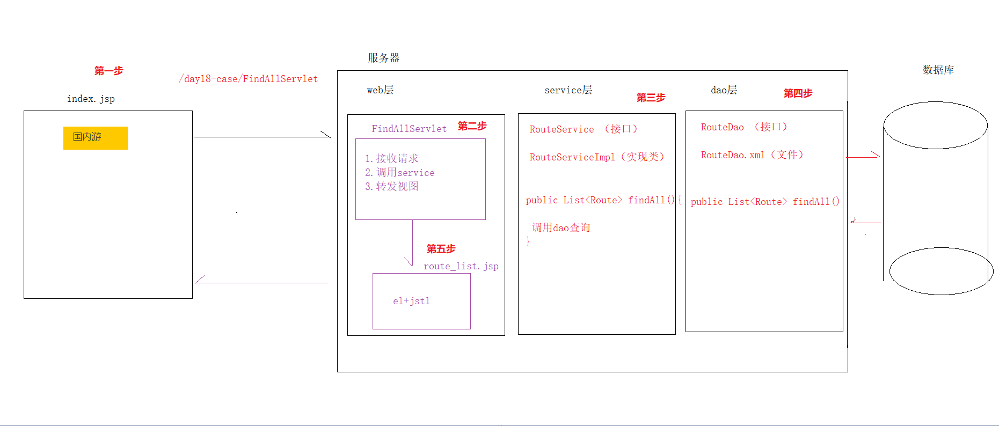
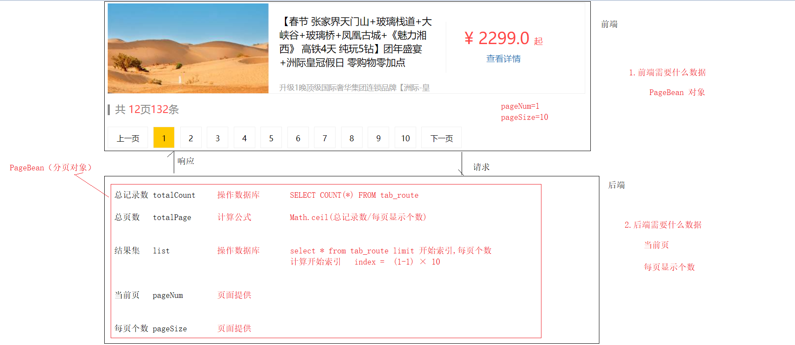
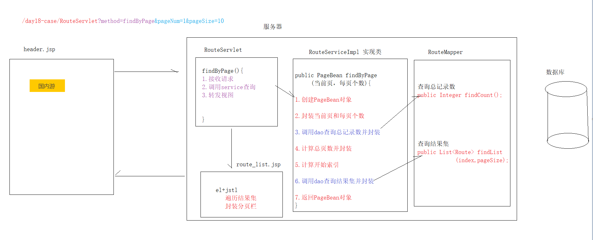
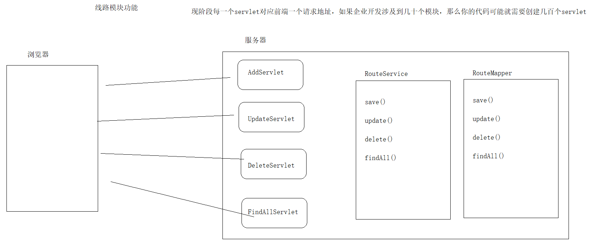
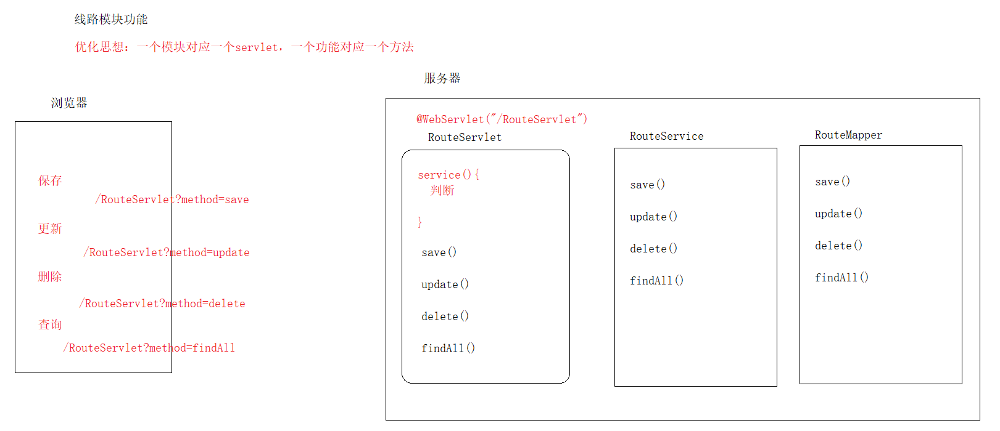

## 今日目标

+ 回顾核心配置文件标签

+ mybatis注解开发
	+ 单表【掌握】
	+ 多表【了解】
	
+ mybatis案例练习
	+ 基于B/S架构，做一个查询（分页）


## 一  核心配置文件回顾

**SqlMapConfig.xml 中配置的内容和顺序如下：**  

- properties（属性）
- settings（全局配置参数）
- typeAliases（类型别名）
- typeHandlers（类型处理器）
- objectFactory（对象工厂）
- plugins（插件）
- environments（数据库环境配置）
  - environment（数据库环境子属性对象）
    - transactionManager（事务管理）
    - dataSource（数据源）
- mappers（映射器）

### 1 properties标签

> 加载外部的properties文件
>

```xml
<properties resource="jdbc.properties"></properties>
```


### 2 settings标签

> 全局参数配置
>

```xml
<settings>
    <!--开启懒加载-->
    <setting name="lazyLoadingEnabled" value="true"/>
    <!-- 指定触发延迟加载的方法 -->
    <setting name="lazyLoadTriggerMethods" value=""/>
</settings>
```


### 3 typeAliases标签

> 为 Java 类型设置一个别名
>

```markdown
1. 单个定义别名（了解）

    <typeAliases>
        <typeAlias type="cn.itcast.domain.User" alias="user"></typeAlias>
    </typeAliases>

1. 使用包的形式批量定义别名

    <typeAliases>
        <package name="cn.itcast.domain"></package>
    </typeAliases>
```


### 4 mappers标签

> 加载映射配置
>

```markdown
1. 加载指定的src目录下的映射文件，例如：

	<mapper resource="com/itheima/mapper/UserMapper.xml"/>
	
2. 加载指定包目录下的映射接口，例如：

	<mapper class="com.itheima.mapper.UserMapper"/>

3. 加载并扫描指定包下所有的映射文件（接口），例如：

    <!--配置映射文件-->
    <mappers>
       <!-- <mapper resource="com/itheima/mapper/UserMapper.xml"></mapper>-->
        <!--使用扫描包的方式有一个前置条件，映射文件命名必须跟映射接口一致，且在同一包下-->
        <package name="com.itheima.mapper"></package>
    </mappers>
```


### 5 environments标签

> 数据源环境配置
>

```markdown
<environments default="mysql">
    <environment id="mysql">
    	<!--事务管理器：使用JDBC-->
        <transactionManager type="JDBC"/>
        <!--数据源：使用内置连接池-->
        <dataSource type="POOLED">
            <property name="driver" value="${jdbc.driver}"/>
            <property name="url" value="${jdbc.url}"/>
            <property name="username" value="${jdbc.username}"/>
            <property name="password" value="${jdbc.password}"/>
        </dataSource>
    </environment>
</environments>
```

```markdown
1. 其中，事务管理器（transactionManager）类型有两种：
	* JDBC：
		这个配置就是直接使用了JDBC 的提交和回滚设置，它依赖于从数据源得到的连接来管理事务作用域。
		
	* MANAGED：
		这个配置几乎没做什么。它从来不提交或回滚一个连接，而是让容器来管理事务的整个生命周期。
		例如：mybatis与spring整合后，事务交给spring容器管理。
	
2. 其中，数据源（dataSource）常用类型有二种：
	* UNPOOLED：
		这个数据源的实现只是每次被请求时打开和关闭连接。
		
	* POOLED：
		这种数据源的实现利用“池”的概念将 JDBC 连接对象组织起来。
```


## 二 MyBatis注解

这几年来注解开发越来越流行，Mybatis也可以使用注解开发方式，这样我们就可以减少编写Mapper映射文件了。我们先围绕一些基本的CRUD来学习，再学习复杂映射多表操作。

### 1 MyBatis常用注解

```markdown
* @Insert：实现新增，代替了<insert></insert>
 
* @Update：实现更新，代替了<update></update>

* @Delete：实现删除，代替了<delete></delete>

* @Select：实现查询，代替了<select></select>

* @Result：实现结果集封装，代替了<result></result>

* @Results：可以与@Result 一起使用，封装多个结果集，代替了<resultMap></resultMap>

* @One：实现一对一结果集封装，代替了<association></association>
 
* @Many：实现一对多结果集封装，代替了<collection></collection>
```


### 2 MyBatis单表操作【掌握】


##### ① UserMapper接口

```java
public interface UserMapper {

    @Select("select * from user where id = #{id}")
    public User findById(Integer id);

    @Select("select id as uid ,username as uname,birthday as bir , sex as gender ,address as addr from user")
    @Results({
            @Result(column = "uid", property = "id", id = true),  // 相当于<id></id>
            @Result(column = "uname", property = "username"), // 相当于<result></result>
            @Result(column = "bir", property = "birthday"),
            @Result(column = "gender", property = "sex"),
            @Result(column = "addr", property = "address")
    }) // 相当于<resultMap></resultMap>
    public List<User> findAll();

    @Insert("insert into user values(null,#{username},#{birthday},#{sex},#{address})")
    public void save(User user);

    @Update("update user set username = #{username},sex = #{sex},address = #{address},birthday= #{birthday} where id = #{id}")
    public void update(User user);


    @Delete("delete from user where id = #{id}")
    public void delete(Integer id);
}
```

##### ② 测试

```java
import cn.com.mryhl.domain.User;
import cn.com.mryhl.mapper.UserMapper;
import org.junit.Test;

import java.util.Date;
import java.util.List;

public class UserMapperTest extends BaseMapperTest {
    /**
     * 用户查询
     */
    @Test
    public void test01() throws Exception {
        UserMapper userMapper = sqlSession.getMapper(UserMapper.class);
        User user = userMapper.findById(41);
        System.out.println(user);
    }

    /**
     * 查询所有
     */
    @Test
    public void test02() throws Exception {
        UserMapper userMapper = sqlSession.getMapper(UserMapper.class);
        List<User> all = userMapper.findAll();
        for (User user : all) {
            System.out.println(user);
        }
        //System.out.println(all);
    }

    /**
     * 插入测试
     */
    @Test
    public void test03() throws Exception {
        UserMapper userMapper = sqlSession.getMapper(UserMapper.class);
        User user = new User();
        user.setUsername("印度小啊三");
        user.setAddress("横河");
        user.setBirthday(new Date());
        user.setSex("不详");

        userMapper.save(user);
    }

    /**
     * 修改测试
     */
    @Test
    public void test04() throws Exception {
        UserMapper userMapper = sqlSession.getMapper(UserMapper.class);
        User user = new User();
        user.setId(58);
        user.setUsername("东方萨关");
        user.setAddress("横河");
        user.setBirthday(new Date());
        user.setSex("男");

        userMapper.update(user);
    }

    /**
     * 删除
     */
    @Test
    public void test05() throws Exception {
        UserMapper userMapper = sqlSession.getMapper(UserMapper.class);
        userMapper.delete(58);
    }

}
```

### 3 MyBatis多表操作【了解】

之前我们在映射文件中通过配置`<resultMap>、<association>、<collection>`来实现复杂关系映射。

使用注解开发后，我们可以使用`@Results、@Result，@One、@Many`注解组合完成复杂关系的配置。


> 注解多表查询，底层使用的mybatis嵌套


#### 1 一对一查询

> 需求：查询一个订单，与此同时查询出该订单所属的用户
>

**一对一查询语句**

```sql
SELECT * FROM orders where id = #{id};
SELECT * FROM `user` WHERE id = #{订单的uid};
```


##### ① OrderMapper接口

```java
import cn.com.mryhl.domain.Order;
import org.apache.ibatis.annotations.Select;
import java.util.List;
public interface OrderMapper {

    /**
     * 根据订单id查询,返回订单信息和用户信息
     */
    @Select("SELECT * FROM orders where id = #{id};")
    public Order findByIdWithUser(Integer id);
    
}
```

##### ② UserMapper接口

```java
import cn.com.mryhl.domain.User;
import org.apache.ibatis.annotations.Select;

public interface UserMapper {

    /**
     * 根据用户id找用户
     *
     */
    @Select("SELECT * FROM `user` WHERE id = #{id};")
    public User findById(Integer id);
}
```

##### ③ 注解嵌套

> 订单嵌套用户

```java
/**
 * 根据订单id查询,返回订单信息和用户信息
 */
@Select("SELECT * FROM orders where id = #{id};")
@Results({
        @Result(column="id",property="id",id = true),
        @Result(column="ordertime",property="ordertime"),
        @Result(column="money",property="money"),
        @Result(property = "user",column = "uid" ,one = @One(select="cn.com.mryhl.mapper.UserMapper.findById"))
})
public Order findByIdWithUser(Integer id);
```


##### ④ 测试

```java
import cn.com.mryhl.domain.Order;
import cn.com.mryhl.mapper.OrderMapper;
import org.junit.Test;

public class OrderMapperTest extends BaseMapperTest {
    /**
     * 一对一测试
     */
    @Test
    public void test01() throws Exception {
        //获取代理对象
        OrderMapper orderMapper = sqlSession.getMapper(OrderMapper.class);
        // 查询
        Order order = orderMapper.findByIdWithUser(1);

        System.out.println(order);

        // Order{id=1, ordertime=Mon May 20 02:58:02 CST 2019, money=999.5, user=User{id=41, username='老王', birthday=Mon May 27 17:47:08 CST 2019, sex='男', address='北京', roleList=null, orderList=null}}
    }
}
```


#### 2 一对多查询

> 需求：查询一个用户，与此同时查询出该用户具有的订单
>

**一对多查询语句**

```sql
SELECT * FROM `user` where id = #{id};
SELECT * FROM orders where uid = #{用户id};
```


##### ① UserMapper接口

```java
/**
 * 一对多查询
 *
 */
@Select("SELECT * FROM `user` where id = #{id};")
public User findByIdWithOrderList(Integer id);
```

##### ② OrderMapper接口

```java
/**
 * 根据uid查询订单列表
 */
@Select("SELECT * FROM orders where uid = #{uid};")
public List<Order> findByUid(Integer uid);
```


##### ③ 注解嵌套

> 用户嵌套订单

```java
    /**
     * 一对多查询
     *
     */
    @Select("SELECT * FROM `user` where id = #{id};")
    @Results({
            @Result(column = "id",property = "id",id=true),
            @Result(column = "birthday",property ="birthday" ),
            @Result(column = "sex",property ="sex" ),
            @Result(column = "username",property ="username" ),
            @Result(column = "address",property ="address" ),

            @Result(property = "orderList",column = "id",many = @Many(select = "cn.com.mryhl.mapper.OrderMapper.findByUid"))
    })
    public User findByIdWithOrderList(Integer id);
```


##### ④ 测试

```java
/**
 * 一对多测试
 */
@Test
public void test01() throws Exception {
    //  创建代理对象
    UserMapper mapper = sqlSession.getMapper(UserMapper.class);

    // 根据用户ID查询
    User byIdWithOrderList = mapper.findByIdWithOrderList(41);
    System.out.println(byIdWithOrderList);

    // User{id=41, username='老王', birthday=Mon May 27 17:47:08 CST 2019, sex='男', address='北京', roleList=null, orderList=[Order{id=1, ordertime=Mon May 20 02:58:02 CST 2019, money=999.5, user=null}, Order{id=3, ordertime=Sat Jun 01 21:00:02 CST 2019, money=1666.0, user=null}]}
}
```

### 4 延迟加载

> 不管是一对一、一对多还是多对多 ，在注解配置中都有fetchType的属性

* fetchType = FetchType.LAZY	表示懒加载
* fetchType = FetchType.EAGER 表示立即加载
* fetchType = FetchType.DEFAULT 表示使用全局配置

### 5 二级缓存【了解】

> 在Mapper接口中使用注解配置二级缓存即可

```java
@CacheNamespace
public interface UserMapper {...}
```


### 6 知识小结

1. 注解开发和xml配置相比，从开发效率来说，注解编写更简单，效率更高。
2. 从可维护性来说，注解如果要修改，必须修改源码，会导致维护成本增加。xml维护性更强。
3. 对于单表的CRUD可以使用注解，对于复制查询和多表关联建议使用XML，可以混合开发


## 三 MyBatis案例练习【重点】

**场景**

后续我们持久层框架就选用mybatis了，接下来我们拿web综合案例的旅游线路模块，做一个练习，巩固下mybatis的使用。


### 1 编程风格

> 浏览测试：Chrome、Firefox
>
> 包命名规范：公司域名倒写.模块
>
> 类命名规范：大驼峰式命名
>
> 方法命名规范：小驼峰式命名 （findAll、save、findById）

**一句话总结，帅哥写啥，你写啥**


### 2 环境搭建

> 技术选型：采用三层架构的方式，实现本次需求，dao（mapper）层使用mybatis框架操作数据库

##### ① 准备数据库和表

| 项目   | 内容      |
| ------ | --------- |
| 数据库 | web18     |
| 表     | tab_route |


##### ② 创建web模块lib文件夹，并导入相关jar包

| 编号 | jar包                           | 描述           |
| ---- | ------------------------------- | -------------- |
| 1    | commons-beanutils-1.8.3.jar     |                |
| 2    | commons-logging-1.1.1.jar       |                |
| 3    | javax.servlet.jsp.jstl.jar      | jstl支持包     |
| 4    | jstl-impl.jar                   | jstl支持包     |
| 5    | lombok-1.18.12.jar              | lombok插件包   |
| 6    | mybatis-3.5.1.jar               | mybatis框架包  |
| 7    | mysql-connector-java-5.1.47.jar | jdbc数据库驱动 |


##### ③ 导入页面资源

css js img jsp等页面资源

##### ④ 导入Route实体

com.itheima.domain.Route

##### ⑤ 导入mybatis的接口和映射文件

com.itheima.dao.RouteMapper

##### ⑥ 导入mybatis的核心文件

com.itheima.util.MyBatisUtils

##### ⑦ 导入mybatis工具类

com.itheima.util.MyBatisUtils

##### ⑧ 导入filter过滤器

中文过滤器

com.itheima.web.filter.EncodingFilter

##### ⑨ tomcat部署并测试


### 3 查询所有

#### 需求

点击首页导航条“国内游”分类，跳转到该分类下的线路查询列表


#### 需求分析

 


#### 代码实现

##### ① index.jsp （header.jsp）

```jsp
<li><a href="${pageContext.request.contextPath}/RouteServlet?method=findAll">国内游</a></li>
```

##### ② FindAllServlet

```java
@WebServlet("/FindAllServlet")
public class FindAllServlet extends HttpServlet {
    @Override
    protected void doGet(HttpServletRequest request, HttpServletResponse response) throws ServletException, IOException {
        this.doPost(request, response);
    }

    @Override
    protected void doPost(HttpServletRequest request, HttpServletResponse response) throws ServletException, IOException {
        // 调用service
        RouteServiceImpl routeService = new RouteServiceImpl();
        List<Route> all = routeService.findAll();

        // 转发视图
        request.setAttribute("list",all);
        request.getRequestDispatcher("/route_list.jsp").forward(request,response);


    }
}
```

##### ③ UserService（接口+实现类）

```java
public interface RouteService {

    public List<Route> findAll();
}
```


```java
public class RouteServiceImpl implements RouteService {

    @Override
    public List<Route> findAll() {
        // 获取RouteDao代理对象
        SqlSession sqlSession = MyBatisUtils.openSession();
        RouteMapper routeMapper = sqlSession.getMapper(RouteMapper.class);

        List<Route> list = routeMapper.findAll();

        MyBatisUtils.release(sqlSession);

        return list;
    }
}
```


##### ④ UserDao（接口）

```java
public interface RouteMapper {
 	@Select("select * from tab_route")
    List<Route> findAll();
}

```

##### ⑤ route_list.jsp

```jsp
<ul>
    <c:forEach items="${list}" var="route">
        <li>
            <div class="img"></div>
            <div class="text1">
                <p>${route.rname}</p>
                <br/>
                <p>${route.routeIntroduce}</p>
            </div>
            <div class="price">
                <p class="price_num">
                    <span>&yen;</span>
                    <span>${route.price}</span>
                    <span>起</span>
                </p>
                <p><a href="#">查看详情</a></p>
            </div>
        </li>
    </c:forEach>
</ul>
```


### 4 分页查询【核心】

> 导入：旅游线路分页.sql 数据


> 如何实现分页查询
>
> 物理分页：可以操作数据库实现（MySQL的limit关键字）
>
> 逻辑分页：查询所有，通过java代码进行逻辑分页【已经淘汰，我们作为了解】


#### MySQL分页回顾

```sql
-- sql语法
select * from 表名 limit 开始索引,每页显示个数;

-- 模拟百度分页，共19条记录，一页展示5条

-- 第一页
select * from 表名 limit 0,5;
-- 第二页
select * from 表名 limit 5,5;
-- 第三页
select * from 表名 limit 10,5;
-- 第四页
select * from 表名 limit 15,5;

-- 索引公式
index  = (当前页-1) × 每页显示个数;


-- 明确一个事项：当前页和每页显示的个数都是由 用户提供的
```


#### 分页的整体流程

 


#### PageBean创建

```java
import lombok.AllArgsConstructor;
import lombok.Data;
import lombok.NoArgsConstructor;

import java.util.List;

@Data
@NoArgsConstructor
@AllArgsConstructor
public class PageBean<E> {
    private  Integer totalCount;
    private  Integer totalPage;
    private List<E> list;
    private  Integer pageNum;
    private  Integer pageSize;
}
```


#### 代码执行流程

 


#### 代码实现

##### ① header.jsp

```jsp
 <li>
            <a href="${pageContext.request.contextPath}/RouteServlet?method=findByPage&pageNum=1&pageSize=10">国内游</a>
        </li>
```


##### ② RouteServlet

> 切记别忘了if判断

```java
 @Override
    public void service(HttpServletRequest request, HttpServletResponse response) throws ServletException, IOException {
        // 获取前台传的值
        String method = request.getParameter("method");
        if ("findAll".equals(method)){
            this.findAll(request,response);
        }else if ("findByPage".equals(method)){
            this.findByPage(request,response);

        }
    }
```

 


```java
// 1 接收请求参数
        Integer pageNum = Integer.valueOf(request.getParameter("pageNum"));
        Integer pageSize = Integer.valueOf(request.getParameter("pageSize"));

        // 2 调用service

        RouteServiceImpl routeService = new RouteServiceImpl();
        PageBean<Route> pb = routeService.findByPage(pageNum, pageSize);

        // 3 转发实体
        request.setAttribute("pb",pb);
        request.getRequestDispatcher("route_list.jsp").forward(request,response);
```


##### ③ RouteService(接口+实现类)

```java
 public PageBean<Route> findByPage(Integer pageNum,Integer pageSize);
```


```java
   @Override
    public PageBean<Route> findByPage(Integer pageNum, Integer pageSize) {
        // 这里有7步
        // 获取代理对象
        SqlSession sqlSession = MyBatisUtils.openSession();
        RouteMapper routeMapper = sqlSession.getMapper(RouteMapper.class);

        // 获取实体对象
        PageBean<Route> pb = new PageBean<>();
        // 封装当前页和每页个数
        pb.setPageNum(pageNum);
        pb.setPageSize(pageSize);

        // 调用dao查询条数
        Integer count = routeMapper.findCount();
        pb.setTotalCount(count);

        // 计算页数
        Integer ceil = (int) Math.ceil(count * 1.0 / pageSize);
        pb.setTotalPage(ceil);

        Integer index = (pageNum -1) * pageSize;

        List<Route> list = routeMapper.findList(index, pageSize);
        pb.setList(list);


        // 需要释放资源
        MyBatisUtils.release(sqlSession);
        return pb;
    }
```


##### ④ RouteMapper（接口）

```java
/**
     * 获取总条数
     * @return
     */
    @Select("select count(*) from tab_route")
    Integer findCount();


    /**
     * 获取当前页面结果集
     */
    @Select("select * from tab_route limit #{index},#{pageSize}")
    List<Route> findList(@Param("index") Integer index, @Param("pageSize") Integer pageSize);

```


##### ⑤ route_list.jsp

> 仔细点....

```jsp
<%--线路列表 start--%>
<div class="left">
    <div class="header">
        <span>商品信息</span>
        <span class="jg">价格</span>
    </div>
    <ul>
        <c:forEach items="${pb.list}" var="route">
            <li>
                <div class="img"></div>
                <div class="text1">
                    <p>${route.rname}</p>
                    <br/>
                    <p>${route.routeIntroduce}</p>
                </div>
                <div class="price">
                    <p class="price_num">
                        <span>&yen;</span>
                        <span>${route.price}</span>
                        <span>起</span>
                    </p>
                    <p><a href="#">查看详情</a></p>
                </div>
            </li>
        </c:forEach>
    </ul>


    <%--分页--%>
    <div class="page_num_inf">
        <i></i> 共
        <span>${pb.totalPage}</span>页<span>${pb.totalCount}</span>条
    </div>
    <div class="pageNum">
        <ul>
            <c:if test="${pb.pageNum > 1}">
                <li class="threeword"><a href="${pageContext.request.contextPath}/RouteServlet?method=findByPage&pageNum=${pb.pageNum-1}&pageSize=10">上一页</a></li>
            </c:if>

            <c:forEach begin="1" end="${pb.totalPage}" var="page">
                <c:if test="${page == pb.pageNum}">
                    <li class="curPage"><a href="${pageContext.request.contextPath}/RouteServlet?method=findByPage&pageNum=${page}&pageSize=10">${page}</a></li>
                </c:if>
                <c:if test="${page != pb.pageNum}">
                    <li ><a href="${pageContext.request.contextPath}/RouteServlet?method=findByPage&pageNum=${page}&pageSize=10">${page}</a></li>
                </c:if>
            </c:forEach>
            <c:if test="${pb.pageNum < pb.totalPage}">
                <li class="threeword"><a href="${pageContext.request.contextPath}/RouteServlet?method=findByPage&pageNum=${pb.pageNum+1}&pageSize=10">下一页</a></li>
            </c:if>
        </ul>
    </div>
</div>
<%--线路列表--%>
```


### 5 优化Servlet

> 现在编写servlet的窘境

 


> 优化思想

 


##### ① header.jsp

```jsp
<%--<li><a href="${pageContext.request.contextPath}/RouteServlet?method=findAll">国内游</a></li>--%>
        <li>
            <a href="${pageContext.request.contextPath}/RouteServlet?method=findByPage&pageNum=1&pageSize=10">国内游</a>
        </li>
```

 

##### ② RouteServlet

```java
@WebServlet("/RouteServlet")
public class RouteServlet extends HttpServlet {
 @Override
    public void service(HttpServletRequest request, HttpServletResponse response) throws ServletException, IOException {
        // 获取前台传的值
        String method = request.getParameter("method");
        if ("findAll".equals(method)){
            this.findAll(request,response);
        }else if ("findByPage".equals(method)){
            this.findByPage(request,response);

        }
    }


    protected void findAll(HttpServletRequest request, HttpServletResponse response) throws ServletException, IOException {
        // 调用service
        RouteServiceImpl routeService = new RouteServiceImpl();
        List<Route> all = routeService.findAll();

        // 转发视图
        request.setAttribute("list",all);
        request.getRequestDispatcher("/route_list.jsp").forward(request,response);
    }

    protected void findByPage(HttpServletRequest request, HttpServletResponse response) throws ServletException, IOException {
        // 1 接收请求参数
        Integer pageNum = Integer.valueOf(request.getParameter("pageNum"));
        Integer pageSize = Integer.valueOf(request.getParameter("pageSize"));

        // 2 调用service

        RouteServiceImpl routeService = new RouteServiceImpl();
        PageBean<Route> pb = routeService.findByPage(pageNum, pageSize);

        // 3 转发实体
        request.setAttribute("pb",pb);
        request.getRequestDispatcher("route_list.jsp").forward(request,response);
    }
}
```


### 6 Lombok

Lombok提供了简单的注解的形式来帮助我们简化消除一些必须有但显得很臃肿的 java 代码。通过使用对应的注解，可以在编译源码的时候生成对应的方法，所以不会影响任何运行效率。

#### **3.6.1 常用的 Lombok注解**

```markdown
* @Data：注解在类上；生成toString，getter/setter

* @NoArgsConstructor：注解在类上；为类提供一个无参的构造方法

* @AllArgsConstructor：注解在类上；为类提供一个全参的构造方法
```

#### 6.2 IDEA配置lombok插件支持

> 在设置setting 中找到plugins。在检索框中检索lombok 点击安装

> 在setting中找到Build... ->Compiler -> Annotation Processors界面，在Enable annotation processing左框出打钩

> 重启idea，大功告成


#### 6.3 项目中使用

##### ① 导入jar包

> lombok-1.18.12.jar

##### ② 修改实体类

```java
import lombok.AllArgsConstructor;
import lombok.Data;
import lombok.NoArgsConstructor;

import java.util.List;

@Data
@NoArgsConstructor
@AllArgsConstructor
public class PageBean<E> {
    private  Integer totalCount;
    private  Integer totalPage;
    private List<E> list;
    private  Integer pageNum;
    private  Integer pageSize;
}

```


### 7 MybatisX

MybatisX 是一款基于 IDEA 的快速开发插件，为效率而生，主要功能有：

- Java 与 XML 调回跳转
- Mapper 方法自动生成 XML

#### 7.1 IDEA配置MybatisX插件支持

> 打开 IDEA，进入 File -> Settings -> Plugins -> Browse Repositories，输入 `mybatisx` 搜索并安装


> 重启

## 总结

```markdown
一 核心配置文件回顾
	properties标签
		加载外部的properties文件
	settings标签
		全局参数配置
	typeAliases标签
		为 Java 类型设置一个别名
	mappers标签
		加载映射配置
	environments标签
		数据源环境配置
二 MyBatis注解
	单表增删改查
		* @Insert：实现新增，代替了<insert></insert>
		* @Update：实现更新，代替了<update></update>
		* @Delete：实现删除，代替了<delete></delete>
		* @Select：实现查询，代替了<select></select>
			@Results手动映射封装<resultMap><resultmap>
	多表查询
		
		
三 MyBatis案例练习
	分页查询
		前端所需数据
			PageBean
		后端所需数据
			pageNum
			pageSize
	优化Servlet
		
```

